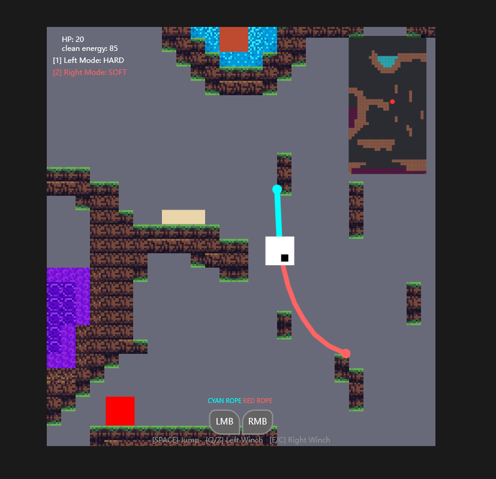

# 2026-group-6
2026 COMSM0166 group 6

# COMSM0166 Project Template
A project template for the Software Engineering Discipline and Practice module (COMSM0166)

## KanBan Link
https://comsm0166-group6.atlassian.net/jira/software/projects/KAN/boards/1

## Info

This is the template for your group project repo/report. We'll be setting up your repo and assigning you to it after the group forming activity. You can delete this info section, but please keep the rest of the repo structure intact.

You will be developing your game using [P5.js](https://p5js.org) a javascript library that provides you will all the tools you need to make your game. However, we won't be teaching you javascript, this is a chance for you and your team to learn a (friendly) new language and framework quickly, something you will almost certainly have to do with your summer project and in future. There is a lot of documentation online, you can start with:

- [P5.js tutorials](https://p5js.org/tutorials/) 
- [Coding Train P5.js](https://thecodingtrain.com/tracks/code-programming-with-p5-js) course - go here for enthusiastic video tutorials from Dan Shiffman (recommended!)

## Your Game (change to title of your game)

### description
This is a non-linear level-based game that combines side-scrolling platforming, puzzle-solving, and lightweight RPG elements, with the core theme of "purifying pollution and ecological restoration." Players use rope tools to delve into highly polluted areas, gradually restoring the planet's ecology. Different levels of purification completion will determine the future direction and the end of the world. 

### demo image: v2.1

(updated in 18/02/26)

  

### TRY TO START GAME

  <a href = "https://uob-comsm0166.github.io/2026-group-6/"> Start Game </a>

VIDEO. Include a demo video of your game here (you don't have to wait until the end, you can insert a work in progress video)

## Your Group

  

| Name | Github-Username | Email | Role |
|------|----------|-------|------|
| Qizhou Lu | qizhoul888-crypto | ah25177@bristol.ac.uk | Backend method implementation, mechanism implementation |
| Yifei Niu | yifeiniu0925 | sa25269@bristol.ac.uk | Game content design and requirement analysis, project manager |
| Mengzhou Gao | mengzhou168 | ti25314@bristol.ac.uk | Map and Level Design, Game detail design|
| Ruomu Lu | n-wind-ddd | co25180@bristol.ac.uk | Architecture, integrating front-end and back-end, core code development |
| Hang Su | chaofengming123 | fy25078@bristol.ac.uk | Front-end development, tester, analysis and planning of project progress |
| Jiaying Wang | jiaying2000wang | zb25795@bristol.ac.uk | UI design, feedback, experience, sound effects, summary meeting |

## Project Report

### Introduction

- 5% ~250 words
  
- Describe of the game:
- This is a non-linear level-based game that combines side-scrolling platforming, puzzle-solving, and lightweight RPG elements, with the core theme of "purifying pollution and ecological restoration." Players use rope tools to delve into highly polluted areas, gradually restoring the planet's ecology. Different levels of purification completion will determine the future direction and the end of the world. 
- The game is set on an alien planet on the verge of collapse due to long-term pollution. The indigenous civilization, faced with ecological imbalance, chose to enter a dormant state, waiting to see if the planet could still be repaired. 
- Players will take on the role of an advanced artificial intelligence purification unit sent to the depths of the planet. Using rope tools and cleaning energy, they will penetrate various highly polluted areas, purify contaminated organisms and the environment, and gradually restore the planet's ecosystem. 
- As players carry out purification actions, the planet's environmental structure, passage routes, and ecological status will continue to change. In the end, players do not just "leave the planet"; instead, based on the world's purification level (a percentage mechanism), they will face different endings between escape, coexistence, or reconstruction.

### Requirements 

- 15% ~750 words
- Early stages design. Ideation process. How did you decide as a team what to develop? Use case diagrams, user stories.
#### Reflection
In this project, our team progressively understood and mastered the roles of epics, user stories, and acceptance criteria in software engineering through the example of Running App in the workshop, and how they integrate with our game's context. Early in the project, frequent communication among team members led us to believe we had reached consensus on functional requirements, causing us to underestimate the necessity of formalized requirement descriptions.

This assumption was gradually corrected as requirements were systematically organized and discussed. Organizing requirements into epics enabled high-level, structured planning of game systems—such as the core purification mechanism, exploration and ability unlocking, and world state feedback with ending systems. This approach helped define system boundaries during design and maintain logical consistency between features.

User stories prompted us to reexamine requirements from diverse stakeholder perspectives: players, game designers, game developers, testers, and course instructors. The user-value-oriented description approach made us focus not only on what a feature “does”, but also why it “does it”. This clarified the game's core design theme: promoting sustainable development on a resource-limited planet through “purification”.

Acceptance criteria helped translate abstract design goals into concrete, verifiable, and testable behavioral standards. By defining clear conditions and expected outcomes, team members developed a more consistent understanding of implementation details, while also providing a clear basis for testing and evaluation.

As the game's scope expanded, requirements continued to evolve. Through the ongoing addition, adjustment, or removal of user stories, we optimized the requirements system in a more agile manner. This ensured that the final implemented features aligned with the game's theme while also meeting the course's requirements for testability and maintainability.

### Design

- 15% ~750 words 
- System architecture. Class diagrams, behavioural diagrams. 
#### Class Diagram

  

The class diagram illustrates the core structure of the game, including the GameManager, LevelManager, Player, Entity hierarchy, and the rope-based interaction system.

### Implementation

- 15% ~750 words

- Describe implementation of your game, in particular highlighting the TWO areas of *technical challenge* in developing your game.

### Evaluation

- 15% ~750 words

- One qualitative evaluation (of your choice) 

- One quantitative evaluation (of your choice) 

- Description of how code was tested. 

### Process 

- 15% ~750 words

- Teamwork. How did you work together, what tools and methods did you use? Did you define team roles? Reflection on how you worked together. Be honest, we want to hear about what didn't work as well as what did work, and importantly how your team adapted throughout the project.

### Conclusion

- 10% ~500 words

- Reflect on the project as a whole. Lessons learnt. Reflect on challenges. Future work, describe both immediate next steps for your current game and also what you would potentially do if you had chance to develop a sequel.

### Contribution Statement

- Provide a table of everyone's contribution, which *may* be used to weight individual grades. We expect that the contribution will be split evenly across team-members in most cases. Please let us know as soon as possible if there are any issues with teamwork as soon as they are apparent and we will do our best to help your team work harmoniously together.

### Additional Marks

You can delete this section in your own repo, it's just here for information. in addition to the marks above, we will be marking you on the following two points:

- **Quality** of report writing, presentation, use of figures and visual material (5% of report grade) 
  - Please write in a clear concise manner suitable for an interested layperson. Write as if this repo was publicly available.
- **Documentation** of code (5% of report grade)
  - Organise your code so that it could easily be picked up by another team in the future and developed further.
  - Is your repo clearly organised? Is code well commented throughout?
