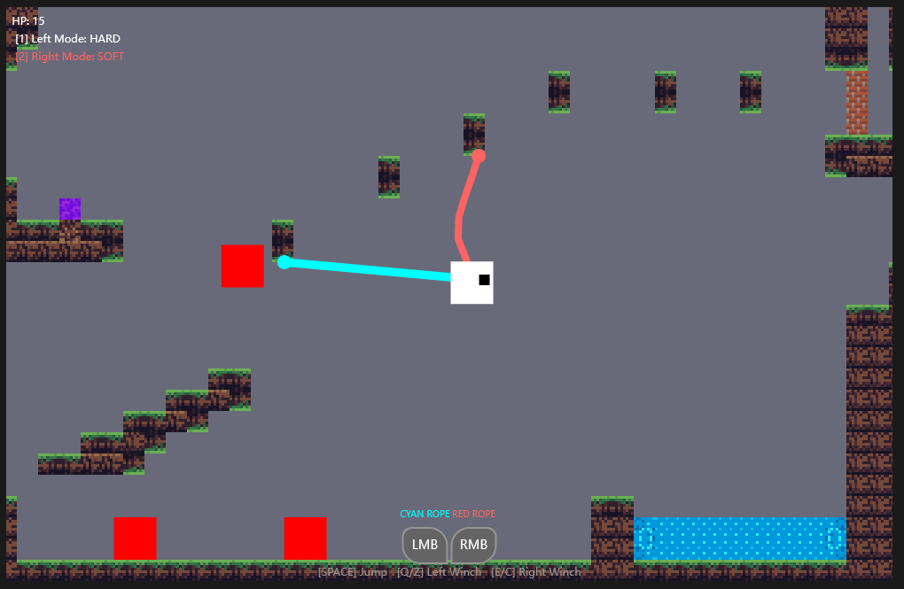

# 2026-group-6
2026 COMSM0166 group 6

# COMSM0166 Project Template
A project template for the Software Engineering Discipline and Practice module (COMSM0166)

## KanBan Link
https://comsm0166-group6.atlassian.net/jira/software/projects/KAN/boards/1

## Info

This is the template for your group project repo/report. We'll be setting up your repo and assigning you to it after the group forming activity. You can delete this info section, but please keep the rest of the repo structure intact.

You will be developing your game using [P5.js](https://p5js.org) a javascript library that provides you will all the tools you need to make your game. However, we won't be teaching you javascript, this is a chance for you and your team to learn a (friendly) new language and framework quickly, something you will almost certainly have to do with your summer project and in future. There is a lot of documentation online, you can start with:

- [P5.js tutorials](https://p5js.org/tutorials/) 
- [Coding Train P5.js](https://thecodingtrain.com/tracks/code-programming-with-p5-js) course - go here for enthusiastic video tutorials from Dan Shiffman (recommended!)

## Your Game (change to title of your game)

STRAPLINE. Add an exciting one sentence description of your game here.

  

IMAGE. Add an image of your game here, keep this updated with a snapshot of your latest development.

  <a href = "https://uob-comsm0166.github.io/2026-group-6/"> Start Game </a>

LINK. Add a link here to your deployed game, you can also make the image above link to your game if you wish. Your game lives in the [/docs](/docs) folder, and is published using Github pages. 

VIDEO. Include a demo video of your game here (you don't have to wait until the end, you can insert a work in progress video)

## Your Group

  

| Name | Github-Username | Email | Role |
|------|----------|-------|------|
| Qizhou Lu | qizhoul888-crypto | ah25177@bristol.ac.uk | Role |
| Yifei Niu | yifeiniu0925 | sa25269@bristol.ac.uk | Role |
| Mengzhou Gao | mengzhou168 | ti25314@bristol.ac.uk | Role |
| Ruomu Lu | n-wind-ddd | co25180@bristol.ac.uk | Role |
| Hang Su | chaofengming123 | fy25078@bristol.ac.uk | Role |
| Jiaying Wang | jiaying2000wang | zb25795@bristol.ac.uk | Role |

## Project Report

### Introduction

- 5% ~250 words
  
- Describe of the game:
- This game is based on the concept of evolution and purification. At the end of this century, the envoriment of the Earth starting to change rapidly because of long-term pollution which is not suitable for human beings to survive so we have to move to another planet in the universe. However, we always remeber the times we spent on the old original home, and that was a question arising from the depths of the soul, a longing for home, can't we go back? Back to our home? After years of persistent efforts and in-depth researches, finally scientists discovered an energy source that can purify soil, ocean, river, atomosphere, even monsters, so almost anything in the world. But you need to discovr the old home with barely no help first since you lost connection with base, so hummm...Hope good luck for you! What new stories are waiting now? Let's explore...

- What makes it novel? What's the "twist"?
- The player started with two rope-like tools made of special materials and no help so has to wait and avoid some monsters, while after your journey going on, suddenly you have the chance to communicate with base. Congraduations! Let's try your new super power to beat the monsters and purify the envoriment. Oh, wait, why you can jump higher and have stronger props now? How should you control they to help you as you want, maybe you need to try several times and hold on! Possiblely you are the hero who will be memoried of all our offsprings since you are the one who kindles the slight fire of hope of the lost epic dream: humanity could return to Earth, the motherland of our ancestor born.

### Requirements 

- 15% ~750 words
- Early stages design. Ideation process. How did you decide as a team what to develop? Use case diagrams, user stories.
#### Reflection
- In this project, our team progressively understood and mastered the roles of epics, user stories, and acceptance criteria in software engineering through the example of Running App in the workshop, and how they integrate with our game's context. Early in the project, frequent communication among team members led us to believe we had reached consensus on functional requirements, causing us to underestimate the necessity of formalized requirement descriptions.
- This assumption was gradually corrected as requirements were systematically organized and discussed. Organizing requirements into epics enabled high-level, structured planning of game systems—such as the core purification mechanism, exploration and ability unlocking, and world state feedback with ending systems. This approach helped define system boundaries during design and maintain logical consistency between features.
- User stories prompted us to reexamine requirements from diverse stakeholder perspectives: players, game designers, game developers, testers, and course instructors. The user-value-oriented description approach made us focus not only on what a feature “does,” but also why it “does it.” This clarified the game's core design theme: promoting sustainable development on a resource-limited planet through “purification.”
- Acceptance criteria helped translate abstract design goals into concrete, verifiable, and testable behavioral standards. By defining clear conditions and expected outcomes, team members developed a more consistent understanding of implementation details, while also providing a clear basis for testing and evaluation.
- As the game's scope expanded, requirements continued to evolve. Through the ongoing addition, adjustment, or removal of user stories, we optimized the requirements system in a more agile manner. This ensured that the final implemented features aligned with the game's theme while also meeting the course's requirements for testability and maintainability.

### Design

- 15% ~750 words 
- System architecture. Class diagrams, behavioural diagrams. 

### Implementation

- 15% ~750 words

- Describe implementation of your game, in particular highlighting the TWO areas of *technical challenge* in developing your game. 

### Evaluation

- 15% ~750 words

- One qualitative evaluation (of your choice) 

- One quantitative evaluation (of your choice) 

- Description of how code was tested. 

### Process 

- 15% ~750 words

- Teamwork. How did you work together, what tools and methods did you use? Did you define team roles? Reflection on how you worked together. Be honest, we want to hear about what didn't work as well as what did work, and importantly how your team adapted throughout the project.

### Conclusion

- 10% ~500 words

- Reflect on the project as a whole. Lessons learnt. Reflect on challenges. Future work, describe both immediate next steps for your current game and also what you would potentially do if you had chance to develop a sequel.

### Contribution Statement

- Provide a table of everyone's contribution, which *may* be used to weight individual grades. We expect that the contribution will be split evenly across team-members in most cases. Please let us know as soon as possible if there are any issues with teamwork as soon as they are apparent and we will do our best to help your team work harmoniously together.

### Additional Marks

You can delete this section in your own repo, it's just here for information. in addition to the marks above, we will be marking you on the following two points:

- **Quality** of report writing, presentation, use of figures and visual material (5% of report grade) 
  - Please write in a clear concise manner suitable for an interested layperson. Write as if this repo was publicly available.
- **Documentation** of code (5% of report grade)
  - Organise your code so that it could easily be picked up by another team in the future and developed further.
  - Is your repo clearly organised? Is code well commented throughout?
