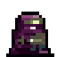
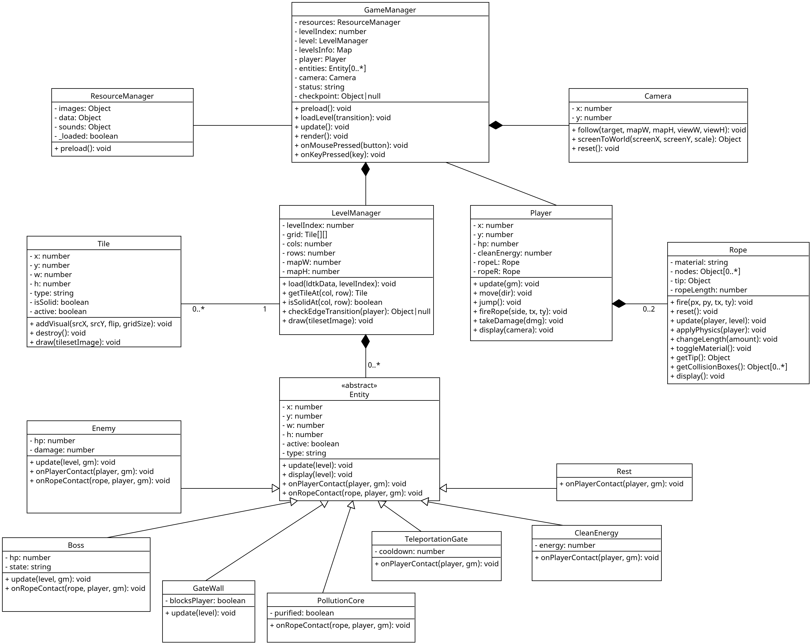
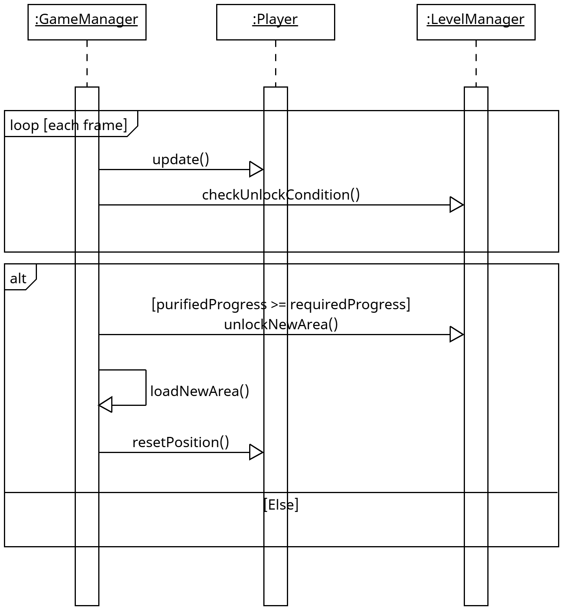
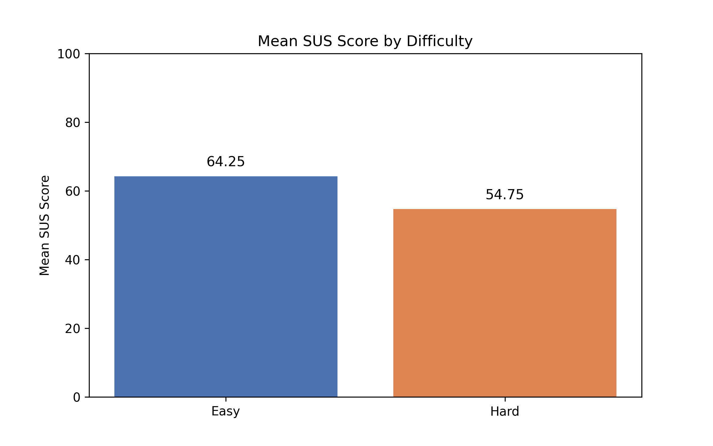

# 2026-group-6
2026 COMSM0166 group 6

# KanBan Link
https://comsm0166-group6.atlassian.net/jira/software/projects/KAN/boards/1

# Echoes of Purity

## description
This is a non-linear level-based game that combines side-scrolling platforming, puzzle-solving, and lightweight RPG elements, with the core theme of "purifying pollution and ecological restoration." Players use rope tools to delve into highly polluted areas, gradually restoring the planet's ecology. Different levels of purification completion will determine the future direction and the end of the world. 

## demo image: v2.5

  

## TRY TO START GAME

  <a href = "https://uob-comsm0166.github.io/2026-group-6/"> Start Game </a>

VIDEO. Include a demo video of your game here (you don't have to wait until the end, you can insert a work in progress video)

<table>
  <tr>
    <td>Attack monster</td>
    <td>Energy Supply</td>
  </tr>
  <tr>
    <td>Purify pollutioncore</td>
    <td>Set a save point and restore hp</td>
  </tr>
  <tr>
    <td>Ropemechanics</td>
  </tr>
</table>

# Your Group

  

| Name | Github-Username | Email | Role |
|------|----------|-------|------|
| Qizhou Lu | qizhoul888-crypto | ah25177@bristol.ac.uk | Backend method implementation, mechanism implementation |
| Yifei Niu | yifeiniu0925 | sa25269@bristol.ac.uk | Game content design and requirement analysis, project manager |
| Mengzhou Gao | mengzhou168 | ti25314@bristol.ac.uk | Map and Level Design, Game detail design|
| Ruomu Lu | n-wind-ddd | co25180@bristol.ac.uk | Architecture, integrating front-end and back-end, core code development |
| Hang Su | chaofengming123 | fy25078@bristol.ac.uk | Front-end development, tester, analysis and planning of project progress |
| Jiaying Wang | jiaying2000wang | zb25795@bristol.ac.uk | UI design, feedback, experience, sound effects, summary meeting |

# Project Report
- [1. Introduction](#1-introduction)
- [2. Game Content](#2-game-content)
- [3. Requirements](#3-requirements)
- [4. Design](#4-design)
- [5. Implementation](#5-implementation)
- [6. Evaluation](#6-evaluation)
- [7. Process](#7-process)
- [8. Sustainability](#8-sustainability)
- [9. Conclusion](#9-conclusion)
- [10. Contribution Statement](#10-contribution-statement)
- [11. Appendix](#11-appendix)
- [12.References](#12-references)

## 1. Introduction

Echoes of Purity is a structured non-linear 2D level game that combines side-scrolling platform jumping and lightweight role-playing elements. The core theme of the game is "purifying pollution and ecological restoration". Players will use the rope tool to enter the highly polluted area and gradually restore the planet's ecology. Different levels of purification completion will determine the future direction and the end of the world.

The game is set on an alien planet on the verge of collapse due to long-term pollution. After severe environmental imbalance, the planet’s native civilization entered a dormant state. The possibility of restoring the planet's ecosystem remains uncertain.Players will take on the role of an advanced artificial intelligence purification unit sent to the severely polluted planet. Using rope tools and cleaning energy, they will penetrate various highly polluted areas, purify contaminated organisms and the environment, and gradually restore the planet's ecosystem.

As players advance through levels and complete purification objectives, the planet’s environmental structure, accessible routes, and ecological conditions gradually evolve. These changes reflect the player’s impact on the world and strengthen the restoration theme.

The final outcome of the game is determined by the player’s purification progress. Each area of the game has many pollution cores and enemies. Successfully purify at least 80% of the pollution cores and the enemies will reach the standard level of completion. Purifying all pollution cores and enemies unlocks a full restoration ending, representing complete ecological recovery.

# 2. Game Content

<table>
<tr>
<th>Category</th>
<th>Name</th>
<th>Image</th>
<th>Description</th>
</tr>

<tr>
<td>Player</td>
<td>Robot</td>
<td></td>
<td>The player character, a small robot that explores the world and purifies pollution.</td>
</tr>

<tr>
<td>Ability</td>
<td>Energy Rope</td>
<td></td>
<td>A rope that can be fired to purify pollution or help the player traverse difficult terrain.</td>
</tr>

<tr>
<td rowspan="2">Interactable</td>
<td>Energy Pillar</td>
<td></td>
<td>A station where the player can recharge purification energy.</td>
</tr>

<tr>
<td>Button</td>
<td></td>
<td>A switch that can be pressed to open certain doors.</td>
</tr>

<tr>
<td>Checkpoint</td>
<td>Respawn Point</td>
<td></td>
<td>The location where the player respawns after death.</td>
</tr>

<tr>
<td>Objective</td>
<td>Pollution Source</td>
<td></td>
<td>A pollution node that must be purified to restore the environment.</td>
</tr>

<tr>
<td>Enemy</td>
<td>Monster</td>
<td></td>
<td>Hostile creatures that attack the player but can also be purified.</td>
</tr>

<tr>
<td rowspan="2">Gate</td>
<td>Area Gate</td>
<td></td>
<td>A gate between areas that opens when the area's purification level reaches 80%.</td>
</tr>

<tr>
<td>Mechanism Door</td>
<td></td>
<td>A door inside the area that opens after pressing a button.</td>
</tr>

<tr>
<td rowspan="2">Environment</td>
<td>Polluted Water</td>
<td></td>
<td>Deadly polluted water that kills the player on contact.</td>
</tr>

<tr>
<td>Clean Water</td>
<td></td>
<td>Safe water that does not harm the player.</td>
</tr>

<tr>
<td>Collectible</td>
<td>Energy Crystal</td>
<td></td>
<td>Scattered crystals that restore the player's purification energy.</td>
</tr>

</table>

# 3. Requirements

## Ideation

  

<b>Figure 1.</b> Ideation process for the design of <i>Echoes of Purity</i>.

In the early stage of the project, we explored game ideas through team brainstorming sessions. Each member first independently proposed a game concept, and then organized these initial ideas in the *gamelist* file of the project repository. This file was used to record different game types, core mechanisms, and potential design directions. By discussing and comparing these ideas, we found that the team members' interests mainly focused on game types that were more exploratory and had a non-linear structure, such as **Metroidvania**. Therefore, during the team discussions in the second and third weeks, we gradually narrowed down the creative direction. We decided to position the project as a non-linear 2D side-scrolling platform game. Players can freely explore different areas and advance the game by gradually unlocking paths.

Based on the determination of the game type, we then delved into the themes that the game intends to convey. We agreed that the game should not only provide an engaging interactive experience but also communicate a meaningful message. Considering the growing global concern about environmental pollution, we chose **environmental restoration and pollution purification** as the core theme of the game. As a result, we proposed a gameplay centered around purifying pollution sources: Players need to remove pollution sources (such as garbage or pollution cores) in the game world, gradually restoring the environment.

  

  <b>Figure 2.</b> Paper Prototypin

In the third-week lab session, we further explored and evaluated our concept by creating a paper prototype of the game. This approach enables low-cost experimentation, making it easier to gather feedback and refine ideas before implementing the system in code. Through this prototype, we were able to visually understand the core gameplay loop, thereby enhancing our comprehension of the player interaction process. This was helpful in guiding the subsequent design and development phases.

## Stakeholder Analysis

In order to better identify the stakeholders involved or affected by the game, we conducted a stakeholder analysis of the project. Following the stakeholder taxonomy proposed by Alexander (2005), we adopted the stakeholder onion model to structure and visualise the different stakeholder groups related to the system. This model helps identify stakeholders based on their relationship and level of interaction with the system, enabling the development team to better understand the project context and stakeholder influence.

  

  <b>Figure 3.</b> Stakeholder Onion Model

To structure our game requirements, we organised them using **epics, user stories, and acceptance criteria**, following the agile requirements format introduced in the lab and lecture.

<table>
<tr>
<th>Epic</th>
<th>User Story</th>
<th>Acceptance Criterion</th>
</tr>

<tr>
<td rowspan="2">Exploration and Traversal</td>
<td>As a player, I want to use a rope tool to traverse difficult terrain so that I can explore polluted areas of the planet.</td>
<td>Given the player is near a rope anchor point, when they activate the rope tool, then the player can swing or climb to reach higher or distant platforms.</td>
</tr>

<tr>
<td>As a player, I want to explore interconnected areas so that I can gradually uncover the world.</td>
<td>Given the player moves through the environment, when they reach a transition point between areas, then the camera follows the player and loads the connected area smoothly.</td>
</tr>

<tr>
<td rowspan="2">Pollution Purification</td>
<td>As a player, I want to purify polluted creatures and cores so that the environment can gradually recover.</td>
<td>Given a polluted creature or core is present, when the player uses cleaning energy, then the pollution entity is removed and the purification progress increases.</td>
</tr>

<tr>
<td>As a player, I want to purify polluted creatures and pollution cores so that I can clear obstacles in my path.</td>
<td>Given a polluted creature or pollution core is present, when the player uses cleaning energy to purify it, then the entity disappears and the path becomes accessible.</td>
</tr>

<tr>
<td rowspan="2">Progression and World State</td>
<td>As a player, I want purification progress to unlock new areas so that exploration feels rewarding.</td>
<td>Given the purification progress reaches a required percentage, when the player approaches a blocked path, then the barrier is removed or a gate opens.</td>
</tr>

<tr>
<td>As a player, I want the final ending to depend on how much pollution I cleaned so that my choices influence the outcome.</td>
<td>Given the player completes the game, when the system evaluates the purification percentage, then the corresponding ending is displayed.</td>
</tr>

<tr>
<td rowspan="2">Player Feedback and UI</td>
<td>As a player, I want to see my purification progress so that I understand how much of the world has been restored.</td>
<td>When the player is in the game interface, the percentage of the world's purification will be displayed.</td>
</tr>

<tr>
<td>As a player, I want clear visual feedback when I purify something so that I understand my actions had an effect.</td>
<td>Given the player purifies an enemy or pollution core, when the purification completes, then a visual effect and sound cue are triggered.</td>
</tr>

</table>

<strong>Table 1.</strong> Epics, user stories and acceptance criteria used in <em>Echoes of Purity</em> development

## Reflection
In this project, our team progressively understood and mastered the roles of epics, user stories, and acceptance criteria in software engineering through the example of Running App in the workshop, and how they integrate with our game's context. Early in the project, frequent communication among team members led us to believe we had reached consensus on functional requirements, causing us to underestimate the necessity of formalized requirement descriptions.

This assumption was gradually corrected as requirements were systematically organized and discussed. Organizing requirements into epics enabled high-level, structured planning of game systems—such as the core purification mechanism, exploration and ability unlocking, and world state feedback with ending systems. This approach helped define system boundaries during design and maintain logical consistency between features.

User stories prompted us to reexamine requirements from diverse stakeholder perspectives: players and development team members. The user-value-oriented description approach made us focus not only on what a feature “does”, but also why it “does it”. This clarified the game's core design theme: promoting sustainable development on a resource-limited planet through “purification”.

Acceptance criteria helped translate abstract design goals into concrete, verifiable, and testable behavioral standards. By defining clear conditions and expected outcomes, team members developed a more consistent understanding of implementation details, while also providing a clear basis for testing and evaluation.

As the game's scope expanded, requirements continued to evolve. Through the ongoing addition, adjustment, or removal of user stories, we optimized the requirements system in a more agile manner. This ensured that the final implemented features aligned with the game's theme while also meeting the course's requirements for testability and maintainability.

## Use-Cases

To better understand how players interact with the game system, we model the main functional interactions using a UML Use Case diagram. By identifying the main participants (players) and key game activities such as exploration, purification and progression, this model provides our team with a structured overview of the system's behavior. This kind of diagram helps to ensure that the main game features are systematically captured, improves communication among team members, and supports consistency between requirements, design decisions and implementation. In addition, a detailed use-case specification is provided in the [Appendix](#11-appendix).

  

  <b>Figure 4.</b> Use-Case Diagram

# 4. Design

- 15% ~750 words 
- System architecture. Class diagrams, behavioural diagrams.

## 4.1 System Architecture

This system employs a modular, object-oriented architecture centred around the `GameManager`, which coordinates interactions between subsystems during gameplay. The overall architecture divides game logic into several independent modules, including game control, level management, entity systems, and resource management, thereby enhancing the system's maintainability and scalability.

During gameplay, the `GameManager` maintains the overall game state and schedules module execution within each frame's update loop. For instance, it updates current game logic, invokes the level management module to refresh level content, and controls screen refreshes. This centralised scheduling mechanism ensures unified progression of game logic per frame.

Resource loading is centrally managed by the `ResourceManager`, while level structure and in-level objects are maintained by the `LevelManager`. By separating these functional modules from core control logic, the system gains greater flexibility in supporting multi-level structures and area transitions. 

## 4.2 Initial Class Diagram

After identifying the user's core requirements, we designed the system's initial class structure. The initial design primarily revolves around the core components essential for game operation, and Figure X illustrates this initial class diagram.

  

  <b>Figure X.</b> Initial Class Diagram

#### 1. GameManager
`GameManager` serves as the system's central control class, responsible for maintaining key components required for game operation, such as `LevelManager`, `Camera`, `ResourceManager`, and `Player`. This class governs the game flow by invoking methods like loadLevel(), update(), and render(), coordinating component updates and rendering within each frame.

#### 2. LevelManager
`LevelManager` loads level data and manages entities within the current level. It maintains an entity collection to store all objects in the level. Additionally, `LevelManager` detects map boundaries and triggers area transitions when necessary.

#### 3. Player
Player-related logic is implemented by `Player`. This class encapsulates attributes such as the player's health, maximum health, and purification energy, whilst providing functions for movement, jumping, and firing ropes. Players can interact with environmental objects through the rope system.

#### 4. Rope
The rope mechanism is implemented by `Rope`. This class manages rope state, length, and energy transfer behaviours, providing methods for deploying ropes, updating rope state, and adjusting length. Each rope associates with a `RopeHead` object to handle interaction logic when the rope head contacts target objects.

#### 5. Entity
To centrally manage interactive objects within levels, the system employs the abstract class `Entity`. Different game object types inherit from this class to implement specific behaviours. For instance, `Enemy` represents hostile characters, while `PollutionCore` denotes environmental targets requiring purification. This inheritance structure enables shared interfaces across objects while preserving distinct behavioural logic.

This foundational design establishes the game's core operational framework, providing a basis for subsequent system functionality expansion.

## 4.3 Final Class Diagram

As development progressed, the game gradually added more features, such as enemy types, environmental interaction objects, and area teleportation mechanisms. To support these new features, the system architecture was further expanded. The final class diagram (Figure X) illustrates the relationships between the main classes in the system.

  

  <b>Figure X.</b> Final Class Diagram

In the final design, `Entity` became the core abstract class of the game object system, extending into several subclasses, such as `Enemy`, `Boss`, `PollutionCore`, `TeleportationGate`, `CleanEnergy`, and `GateWall`. These classes represent different types of game objects and implement their respective interactive behaviors. For example, `Enemy` and `Boss` are used to implement enemy characters, while `CleanEnergy` represents resource objects that players can collect.

Furthermore, the level system was optimized. `LevelManager` uses a `Tile` grid structure to represent the map environment, with each tile recording its position, size, and whether it is solid terrain. This grid-based structure makes level loading, collision detection, and map rendering more efficient.

Finally, the interaction methods between entities have also been standardized. When a player or rope comes into contact with an entity, the interaction methods defined by that entity are called, such as onPlayerContact() or onRopeContact(). Different entities can implement different behaviors based on their own type, such as restoring player resources, triggering teleportation, or updating the polluted core state. This polymorphic interaction method reduces coupling between systems and makes it easier to add new entity types to the system.

## 4.4 Pollution Purification Sequence Diagram
Figure X shows the player's interaction process for purifying the contaminated core via the rope system. This sequence diagram depicts the primary system interaction flow from player input to the purification of the contaminated core.

  

  <b>Figure X.</b> Rope Interaction and Pollution Purification

When the player performs an input action, the input event is first received by the GameManager, triggering the fireRope() method. Subsequently, the Player calls the Rope's fire() method, causing the rope to be fired towards the target direction. During each frame update loop, the GameManager continuously calls the Player's update() method, which in turn updates the Rope's state. When the rope contacts an environmental object, it triggers the target object's onRopeContact() method. In this instance, contact with the PollutionCore initiates the pollution purification logic. If the player's current purification energy satisfies the purification conditions (player.cleanEnergy ≥ purificationCost), the player first expends the corresponding energy. Subsequently, the PollutionCore executes the purifyPollution() method and updates its state. Otherwise, the system triggers the insufficient energy handling logic, maintaining the PollutionCore's current state unchanged.

## 4.5 Unlock New Area Sequence Diagram
Figure X shows the interaction flow for unlocking new areas. This sequence diagram describes how the system determines whether to unlock new game areas based on the player's purification progress, i.e., purification percentage.

  

  <b>Figure X.</b> Unlock New Area

During gameplay, the GameManager calls the Player's update() method within each frame's update loop to continuously refresh the player's state. Concurrently, the system invokes the LevelManager's checkUnlockCondition() method to assess whether the unlock criteria are currently met. If the player's purification progress meet the preset requirement (purifiedProgress ≥ requiredProgress), the system triggers the unlockNewArea() method to unlock the new area. Subsequently, the GameManager loads the new level data and invokes the loadNewArea() method to complete the area transition. Upon completion of the new area's loading, the system resets the player's position via the resetPosition() method to ensure correct entry into the new zone. Should the unlock conditions remain unmet, the system maintains the current state and continues executing the game loop.

# 5. Implementation

## 5.1	Multi-level World State Management

### Level Design and Map Structure

All the levels and maps in this game were manually designed by the team members and created using LDtk (Level Designer Toolkit). Each area of the game world is composed of several connected levels. In this way, we can more flexibly control the layout of the levels, the exploration paths of the players, and the gameplay pacing.

(Picture to be added)

During the map design process, we not only designed the visual layout of the levels, but also defined the logical structure within the levels. Each level contains multiple layers that describe different aspects of the game world. The two most important layers are the Collision Layer and the Entity Layer.

The collision layer defines the physical boundaries of the environment. Elements such as ground, walls, platforms, and other solid structures are placed in this layer. Then, the entity layer defines interactive objects in the game world. Examples include pollution cores, buttons, gates, teleportation points, rest points, and enemies. These objects are defined as entities in LDtk and are instantiated as game objects when the level is loaded.

(Picture to be added)

To support interactive gameplay, we implemented a button–gate control mechanism using the entity system in LDtk. Each button entity can reference a target gate through a field defined in the level editor. This reference uses the unique entity identifier (iid), which creates a link between the button and the corresponding gate.

(Picture to be added)

### Connected Levels and Persistent State

The world of this game is not composed of independent levels, but rather consists of multiple interconnected map areas. Players can move between these levels, and their actions will affect the environmental state of the entire area.To achieve this goal, we implemented a level caching system in the `GameManager`. Levels that had already been loaded were stored in the `levelsInfo` data structure. When the player re-enters the level, the system can restore the state of the entities in that level instead of generating all the objects anew. This ensures that the world state remains persistent.

In terms of map parsing, `LevelManager` reads the collision layers and entity layers in the LDtk file and converts the collision data into a two-dimensional grid structure. This structure allows efficient local collision checks instead of scanning the entire map each frame.

Level connections are achieved through the world position information (`worldX`, `worldY`) and neighbour data (`__neighbours`) provided by LDtk. When the player reaches the boundary of a level, the system calculates the correct neighbouring level and performs a smooth transition. At the same time, the game also implements an area-based purification progress system. Different objects contribute different weights to the purification value of this area. When the purification progress reaches a certain level, the environment will change. For example, some gates open automatically and toxic water areas may become safe water. Additionally, to support interactions between objects across different levels, the entities establish reference relationships through the identifiers(iid) provided by LDtk.

## 5.2 Rope Mechanic Implementation

The rope system is one of the most important gameplay mechanisms in this game. Players can use ropes for movement, attacking enemies, and purifying pollution sources. Therefore, the rope system needs to be closely integrated with the player's movement and map collision systems. At the same time, it must remain stable and responsive during gameplay.

To achieve this mechanism, we have designed the rope as a state machine-based system. The rope includes several states such as `IDLE`, `EXTENDING`, `STRAND`, `SWINGING`, and `RETRACTING`. When the player fires the rope, the rope tip moves forward like a projectile. A ray-casting method is used to detect collisions with solid tiles. If the ray hits a valid surface, that position becomes the anchor point of the rope. The rope is not represented as a simple straight line. Instead, it is modeled as a chain of nodes. This node structure can more naturally simulate the shape of the rope and allow for dynamic adjustment of the rope length during the game. Players can adjust the length of the rope by inputting commands, thereby enabling actions such as swinging, getting closer, or descending.

To simulate realistic rope behavior, distance constraints are applied between neighboring nodes. These constraints ensure that the distance between adjacent nodes remains close to a predefined rope segment length. The rope physics is based on a distance constraint model.

Assume two connected nodes **A** and **B** with positions `pA` and `pB`.  
Let **L** be the desired distance between them (the rope segment length).

**Step 1: Compute the current distance**

$$
\Delta = \mathbf{p_B} - \mathbf{p_A}
$$

$$
d = \|\Delta\|
$$

**Step 2: Compute the correction offset**

$$
\text{offset} = \frac{d - L}{d}
$$

**Step 3: Update node positions**

If both nodes have equal mass, the correction is distributed equally:

$$
\mathbf{p_A} = \mathbf{p_A} + \Delta \cdot \text{offset} \cdot 0.5
$$

$$
\mathbf{p_B} = \mathbf{p_B} - \Delta \cdot \text{offset} \cdot 0.5
$$

The game also offers two different types of rope materials: soft rope and hard rope. The soft rope supports swinging movement, while the hard rope can provide additional collision support. Another technical difficulty was ensuring that the rope physics system works correctly with the platform collision system. If both systems modify the player position independently, unstable movement may occur. To solve this issue, the update process follows a clear order. First, rope constraints are applied to the player. Then world collision detection is performed using the tile grid. Finally, the player position is clamped again to maintain the allowed rope length. This process keeps both the rope system and the platform physics stable. Therefore, the rope system becomes a flexible tool that supports exploration, combat and puzzle interaction in the game.

# 6. Evaluation

- 15% ~750 words

- One qualitative evaluation (of your choice) 

- One quantitative evaluation (of your choice) 

- Description of how code was tested.

## 6.1 Qualitative Evaluation
### Heuristic Evaluation
We invited several evaluators to trial the game and assessed the interface according to Nielsen's ten usability heuristics. This approach was chosen because heuristic evaluation is a common and effective method for identifying usability issues within interactive systems (Nielsen & Morich, 1990; Nielsen, 1994). During the evaluation, we documented primary usability issues and assessed their severity based on frequency, impact, and persistence, thereby calculating an overall severity score (Table X).

<b>Table X.</b> Heuristic Evaluation of <i>Echoes of Purity</i>

<table>
<tr>
<th>Interface</th>
<th>Issue</th>
<th>Heuristic(s)</th>
<th>Frequency</th>
<th>Impact</th>
<th>Persistence</th>
<th>Severity</th>
</tr>

<tr>
<td>HUD (Player Status)</td>
<td>The HP and CleanEnergy values are displayed only as plain text without visual indicators such as bars or icons, making it difficult for players to quickly interpret their current status during gameplay.</td>
<td>Visibility of system status; Recognition rather than recall</td>
<td>3</td>
<td>2</td>
<td>2</td>
<td>2.33</td>
</tr>

<tr>
<td>Game objective</td>
<td>The purification progress indicator may not clearly explain how players can increase the purification percentage.</td>
<td>Match between system and real world</td>
<td>2</td>
<td>2</td>
<td>2</td>
<td>2</td>
</tr>

<tr>
<td>Controls</td>
<td>The game requires players to remember multiple keyboard controls (e.g., WASD, Q, E), which may increase cognitive load and make it difficult for new players to learn the controls quickly.</td>
<td>Recognition rather than recall; Help and documentation</td>
<td>4</td>
<td>2</td>
<td>3</td>
<td>3</td>
</tr>

<tr>
<td>Gameplay introduction</td>
<td>The game does not provide a tutorial or clear instructions for new players, which may make it difficult for them to understand the rope mechanics and purification system.</td>
<td>Help and documentation</td>
<td>2</td>
<td>4</td>
<td>2</td>
<td>2.7</td>
</tr>

<tr>
<td>Rope mechanics</td>
<td>The rope mechanics are not clearly explained to the player, making it difficult for new players to understand how to use the rope for traversal.</td>
<td>Help and documentation; Recognition rather than recall</td>
<td>3</td>
<td>4</td>
<td>3</td>
<td>3.33</td>
</tr>

<tr>
<td>Combat feedback</td>
<td>Monsters do not appear to be knocked back when hit by the player, while the player is knocked back when attacked. This creates inconsistent combat feedback and may make the interaction feel unfair.</td>
<td>Visibility of system status; Consistency and standards</td>
<td>3</td>
<td>3</td>
<td>3</td>
<td>3</td>
</tr>

<tr>
<td>Game difficulty</td>
<td>The game may be too difficult for new players, as the mechanics and challenges require significant practice before players can progress.</td>
<td>Flexibility and efficiency of use</td>
<td>4</td>
<td>4</td>
<td>3</td>
<td>3.7</td>
</tr>
</table>

Based on the results of the heuristic evaluation, we propose the following improvements to address the primary usability issues identified. For the interface, we will incorporate more intuitive HUD designs, such as employing progress bars or icons to represent health and energy. For controls, we will reduce players' cognitive load by simplifying operations or providing key prompts. Additionally, we will introduce straightforward tutorials and hints to assist new players in understanding the rope mechanics and game objectives. Finally, we will appropriately adjust the game's difficulty and refine combat feedback to deliver a clearer and fairer experience for players.

## 6.2 Quantitative Evaluation
## GAME EASY LEVEL
### NASA TLX
<table>
<tr>
<th>Player</th>
<th>Mental Demand</th>
<th>Physical Demand</th>
<th>Temporal Demand</th>
<th>Performance</th>
<th>Effort</th>
<th>Frustration</th>
<th>Average</th>
</tr>

<tr><td>1</td><td>5</td><td>2</td><td>2</td><td>7</td><td>7</td><td>5</td><td>4.67</td></tr>
<tr><td>2</td><td>4</td><td>4</td><td>6</td><td>5</td><td>6</td><td>5</td><td>5.00</td></tr>
<tr><td>3</td><td>7</td><td>6</td><td>2</td><td>8</td><td>8</td><td>7</td><td>6.33</td></tr>
<tr><td>4</td><td>6</td><td>6</td><td>6</td><td>3</td><td>8</td><td>3</td><td>5.33</td></tr>
<tr><td>5</td><td>6</td><td>1</td><td>1</td><td>0</td><td>7</td><td>1</td><td>2.67</td></tr>
<tr><td>6</td><td>4</td><td>2</td><td>3</td><td>3</td><td>7</td><td>3</td><td>3.67</td></tr>
<tr><td>7</td><td>6</td><td>6</td><td>5</td><td>2</td><td>5</td><td>2</td><td>4.33</td></tr>
<tr><td>8</td><td>6</td><td>6</td><td>3</td><td>4</td><td>7</td><td>4</td><td>5.00</td></tr>
<tr><td>9</td><td>3</td><td>5</td><td>3</td><td>8</td><td>2</td><td>2</td><td>3.83</td></tr>
<tr><td>10</td><td>5</td><td>8</td><td>2</td><td>5</td><td>7</td><td>2</td><td>4.83</td></tr>

</table>

### System Usability Scale
<table>
<tr>
<th>Question No \ Player No</th>
<th>1</th>
<th>2</th>
<th>3</th>
<th>4</th>
<th>5</th>
<th>6</th>
<th>7</th>
<th>8</th>
<th>9</th>
<th>10</th>
</tr>

<tr>
<td>1. I think that I would like to use this system frequently.</td>
<td>3</td><td>4</td><td>4</td><td>4</td><td>5</td><td>4</td><td>4</td><td>4</td><td>3</td><td>5</td>
</tr>

<tr>
<td>2. I found the system unnecessarily complex.</td>
<td>3</td><td>3</td><td>4</td><td>3</td><td>1</td><td>2</td><td>2</td><td>2</td><td>3</td><td>1</td>
</tr>

<tr>
<td>3. I thought the system was easy to use.</td>
<td>3</td><td>4</td><td>1</td><td>3</td><td>5</td><td>3</td><td>4</td><td>4</td><td>2</td><td>4</td>
</tr>

<tr>
<td>4. I think that I would need the support of a technical person to be able to use this system.</td>
<td>1</td><td>4</td><td>4</td><td>4</td><td>4</td><td>3</td><td>4</td><td>2</td><td>4</td><td>2</td>
</tr>

<tr>
<td>5. I found the various functions in this system were well integrated.</td>
<td>4</td><td>4</td><td>3</td><td>4</td><td>5</td><td>5</td><td>4</td><td>4</td><td>5</td><td>4</td>
</tr>

<tr>
<td>6. I thought there was too much inconsistency in this system.</td>
<td>2</td><td>1</td><td>2</td><td>3</td><td>1</td><td>1</td><td>2</td><td>1</td><td>1</td><td>2</td>
</tr>

<tr>
<td>7. I would imagine that most people would learn to use this system very quickly.</td>
<td>3</td><td>2</td><td>1</td><td>4</td><td>4</td><td>3</td><td>3</td><td>4</td><td>3</td><td>4</td>
</tr>

<tr>
<td>8. I found the system very cumbersome to use.</td>
<td>3</td><td>1</td><td>3</td><td>2</td><td>1</td><td>2</td><td>2</td><td>2</td><td>1</td><td>2</td>
</tr>

<tr>
<td>9. I felt very confident using the system.</td>
<td>3</td><td>2</td><td>2</td><td>4</td><td>5</td><td>2</td><td>4</td><td>3</td><td>2</td><td>4</td>
</tr>

<tr>
<td>10. I needed to learn a lot of things before I could get going with this system.</td>
<td>2</td><td>3</td><td>3</td><td>3</td><td>2</td><td>3</td><td>4</td><td>4</td><td>3</td><td>2</td>
</tr>

<tr>
<td><b>System Usability Survey Score</b></td>
<td>62.5</td>
<td>60</td>
<td>37.5</td>
<td>60</td>
<td>87.5</td>
<td>65</td>
<td>62.5</td>
<td>70</td>
<td>57.5</td>
<td>80</td>
</tr>

</table>

## GAME Hard LEVEL
### NASA TLX
<table>
<tr>
<th>Player</th>
<th>Mental Demand</th>
<th>Physical Demand</th>
<th>Temporal Demand</th>
<th>Performance</th>
<th>Effort</th>
<th>Frustration</th>
<th>Average</th>
</tr>

<tr><td>1</td><td>6</td><td>2</td><td>1</td><td>5</td><td>8</td><td>6</td><td>4.67</td></tr>
<tr><td>2</td><td>8</td><td>6</td><td>2</td><td>1</td><td>8</td><td>7</td><td>5.33</td></tr>
<tr><td>3</td><td>6</td><td>7</td><td>3</td><td>7</td><td>6</td><td>6</td><td>5.83</td></tr>
<tr><td>4</td><td>8</td><td>8</td><td>6</td><td>6</td><td>8</td><td>3</td><td>6.50</td></tr>
<tr><td>5</td><td>7</td><td>1</td><td>2</td><td>0</td><td>8</td><td>2</td><td>3</td></tr>
<tr><td>6</td><td>5</td><td>7</td><td>2</td><td>9</td><td>3</td><td>6</td><td>5.33</td></tr>
<tr><td>7</td><td>6</td><td>5</td><td>8</td><td>6</td><td>7</td><td>2</td><td>5.67</td></tr>
<tr><td>8</td><td>8</td><td>6</td><td>3</td><td>6</td><td>7</td><td>5</td><td>5.83</td></tr>
<tr><td>9</td><td>5</td><td>6</td><td>4</td><td>8</td><td>7</td><td>7</td><td>6.17</td></tr>
<tr><td>10</td><td>7</td><td>6</td><td>3</td><td>6</td><td>4</td><td>1</td><td>4.50</td></tr>

</table>

### System Usability Scale
<table>
<tr>
<th>Question No \ Player No</th>
<th>1</th>
<th>2</th>
<th>3</th>
<th>4</th>
<th>5</th>
<th>6</th>
<th>7</th>
<th>8</th>
<th>9</th>
<th>10</th>
</tr>

<tr>
<td>1. I think that I would like to use this system frequently.</td>
<td>2</td><td>3</td><td>4</td><td>3</td><td>5</td><td>4</td><td>5</td><td>4</td><td>4</td><td>4</td>
</tr>

<tr>
<td>2. I found the system unnecessarily complex.</td>
<td>3</td><td>5</td><td>4</td><td>3</td><td>1</td><td>4</td><td>2</td><td>4</td><td>1</td><td>4</td>
</tr>

<tr>
<td>3. I thought the system was easy to use.</td>
<td>2</td><td>1</td><td>2</td><td>2</td><td>5</td><td>2</td><td>5</td><td>2</td><td>2</td><td>3</td>
</tr>

<tr>
<td>4. I think that I would need the support of a technical person to be able to use this system.</td>
<td>2</td><td>4</td><td>4</td><td>4</td><td>3</td><td>3</td><td>4</td><td>4</td><td>2</td><td>3</td>
</tr>

<tr>
<td>5. I found the various functions in this system were well integrated.</td>
<td>4</td><td>3</td><td>2</td><td>4</td><td>5</td><td>3</td><td>4</td><td>5</td><td>5</td><td>4</td>
</tr>

<tr>
<td>6. I thought there was too much inconsistency in this system.</td>
<td>1</td><td>1</td><td>2</td><td>3</td><td>1</td><td>1</td><td>2</td><td>1</td><td>2</td><td>3</td>
</tr>

<tr>
<td>7. I would imagine that most people would learn to use this system very quickly.</td>
<td>4</td><td>1</td><td>1</td><td>3</td><td>5</td><td>3</td><td>4</td><td>1</td><td>2</td><td>3</td>
</tr>

<tr>
<td>8. I found the system very cumbersome to use.</td>
<td>3</td><td>1</td><td>3</td><td>3</td><td>1</td><td>2</td><td>2</td><td>4</td><td>1</td><td>3</td>
</tr>

<tr>
<td>9. I felt very confident using the system.</td>
<td>3</td><td>1</td><td>2</td><td>3</td><td>5</td><td>2</td><td>3</td><td>2</td><td>4</td><td>2</td>
</tr>

<tr>
<td>10. I needed to learn a lot of things before I could get going with this system.</td>
<td>2</td><td>4</td><td>4</td><td>4</td><td>1</td><td>4</td><td>4</td><td>4</td><td>4</td><td>3</td>
</tr>

<tr>
<td><b>System Usability Survey Score</b></td>
<td>60</td>
<td>35</td>
<td>35</td>
<td>45</td>
<td>95</td>
<td>50</td>
<td>67.5</td>
<td>42.5</td>
<td>67.5</td>
<td>50</td>
</tr>

</table>

  

  <b>Figure X.</b>

  

  <b>Figure X.</b> 

### Statistical Analysis
To compare the Easy and Hard difficulty levels, we conducted a Wilcoxon signed-rank test. For NASA-TLX workload scores, the critical value was set at **5** (**n = 9, α = 0.05**),as one participant reported identical workload scores for both difficulty levels and was therefore excluded as a tied pair. The calculated W test statistic was **6**, indicating no statistically significant difference between the two difficulty levels in perceived workload. Similarly, a Wilcoxon signed-rank test was applied to the SUS usability scores. The critical value was **8** (**n = 10, α = 0.05**), and the calculated W test statistic was **12**, indicating that there was also no statistically significant difference in perceived system usability between the two difficulty levels. Although the mean scores indicated that the Hard difficulty level produced slightly higher workload and slightly lower usability, these differences were not statistically significant at the sample size used in this study.

## 6.3 How Code Was Tested.

# 7. Process 

- 15% ~750 words

- Teamwork. How did you work together, what tools and methods did you use? Did you define team roles? Reflection on how you worked together. Be honest, we want to hear about what didn't work as well as what did work, and importantly how your team adapted throughout the project.

This section describes the development process of our game. In this project, we adopted an **Agile development approach** to organise team collaboration and project development. The game was gradually improved through **iterative development**, while tasks and development progress were managed using a **Jira Kanban board**. During development, the design was continuously adjusted based on feedback from testing.

## Teamwork

At the beginning of the project, each team member proposed a game idea. After discussion, the final idea was selected through a group vote.

To ensure smooth development, the team maintained a weekly routine:

- **Monday** – Review the progress of the previous week's tasks  
- **Tuesday** – Determine the goals for the current week and assign new tasks  
- **Thursday** – Discuss difficulties encountered during implementation and attempt to resolve them  
- **Friday–Sunday** – Focus on completing the assigned tasks  

During the early stage of the project, the team discussed and determined the overall concept of the game and gradually formed the core functional requirements, such as the **rope interaction system**, **pollution purification mechanics**, and **level exploration**. These features were discussed collectively, and the game design was gradually refined through continuous discussion.

Throughout the development process, the team followed an **iterative development approach** to progressively implement the game system. As the project progressed, new features and improvements were continuously added to the development plan, allowing the game system to gradually evolve and improve.

## Tools and Methods

During the development process, we adopted an **Agile development approach** to organise the project workflow.

Specifically, the development process was divided into multiple development cycles. In each cycle, the team discussed the features that needed to be implemented and assigned tasks to different members. Each member then worked on their respective functional modules, such as gameplay mechanics, level structures, or user interface components. After implementation, the team conducted testing and discussions, and the system was improved based on the feedback obtained.

To manage development tasks more effectively, we used a **Jira Kanban board** to track project progress. The board divided tasks into several stages:

- **To Do** – Tasks that need to be completed  
- **In Progress** – Tasks currently being developed  
- **Done** – Tasks that have been completed and tested  

This visual task management approach allowed the team to clearly understand the current state of the project and ensured that all members were aware of the development progress.

In addition, we used **GitHub** for code management and version control. Team members developed different modules independently and regularly pushed their code to the repository. This allowed the team to gradually integrate different parts of the system while maintaining code consistency.

We also used **Visual Studio Code** as the main development environment and **LDtk** for map and level design.

## Reflection

During the development process, the team encountered several challenges. For example, in the early stage of the project, the responsibilities for some tasks were not clearly defined, which led to multiple members attempting to implement the same functionality simultaneously. To address this issue, the team later clarified task ownership and used the Kanban board more effectively to track task status.

In addition, while collaborating through GitHub, the team occasionally encountered **merge conflicts**. By synchronising the repository more frequently and communicating changes in advance, these issues were gradually reduced.

Overall, through the use of **Agile development practices and Kanban-based task management**, the team was able to organise development activities effectively and successfully implement the main features of the game.

# 8. Sustainability

# 9. Conclusion

- 10% ~500 words

- Reflect on the project as a whole. Lessons learnt. Reflect on challenges. Future work, describe both immediate next steps for your current game and also what you would potentially do if you had chance to develop a sequel.

# 10. Contribution Statement

- Provide a table of everyone's contribution, which *may* be used to weight individual grades. We expect that the contribution will be split evenly across team-members in most cases. Please let us know as soon as possible if there are any issues with teamwork as soon as they are apparent and we will do our best to help your team work harmoniously together.

# 11. Appendix

## **Use Case Specification**

**System:** *Echoes of Purity*

### **UC-01: Explore Polluted Area**

**Primary Actor**  
Player  

**Goal**  
Allow the player to explore interconnected areas of the game world and discover polluted zones that require purification.

**Stakeholders**

- Player – wants to explore the world and access new areas.
- Game system – maintains world state, environment loading, and player position.

**Preconditions**

1. The game session has started or a saved game has been loaded.
2. The player character is present in a playable area of the map.

**Trigger**

The player provides keyboard controls to move the character.

**Main Success Scenario**

1. The player moves the character using directional controls.
2. The game system updates the character’s position in the current area.
3. The camera follows the player as they traverse the environment.
4. When the player reaches the boundary of a connected area, the system loads the next area.
5. The player continues exploration within the new area.

**Alternative Flows**

**A1 – Area Locked by Pollution**

1. The player reaches a blocked passage or polluted gate.
2. The system checks purification progress.
3. If the purification condition is not satisfied, the passage remains inaccessible.

**A2 – Player Falls or Cannot Reach Platform**

1. The player attempts to traverse terrain but fails.
2. The character returns to a reachable platform.
3. The player continues exploration.

**Postconditions**

- The player may discover polluted entities, purification cores, or new traversal paths.
- The current world state and player position are updated.

### **UC-02: Purify Pollution Entities**

**Primary Actor**  
Player  

**Goal**  
Allow the player to remove pollution from enemies or environmental cores to restore parts of the ecosystem.

**Stakeholders**

- Player – wants to restore the environment and progress through the game.
- Game system – tracks pollution entities and purification progress.

**Preconditions**

1. The player is located near a pollution entity or pollution core.
2. The player has access to purification energy.

**Trigger**

The player activates the purification ability.

**Main Success Scenario**

1. The player targets a polluted entity or core.
2. The player activates cleaning energy.
3. The purification action is executed.
4. The pollution entity is removed or transformed.
5. The global purification progress value increases.
6. Visual feedback reflects the purification result.

**Alternative Flows**

**A1 – Target Out of Range**

1. The player activates purification.
2. The system detects no valid target.
3. The action fails and no purification occurs.

**A2 – Interrupted Purification**

1. The player begins purification.
2. The player moves away or stops the action.
3. The purification process is cancelled.

**Postconditions**

- The polluted entity or core is removed or transformed.
- The world’s purification progress is updated.

# . Additional Marks

You can delete this section in your own repo, it's just here for information. in addition to the marks above, we will be marking you on the following two points:

- **Quality** of report writing, presentation, use of figures and visual material (5% of report grade) 
  - Please write in a clear concise manner suitable for an interested layperson. Write as if this repo was publicly available.
- **Documentation** of code (5% of report grade)
  - Organise your code so that it could easily be picked up by another team in the future and developed further.
  - Is your repo clearly organised? Is code well commented throughout?

 # 12. References

Alexander, I. F. (2005). *A taxonomy of stakeholders: Human roles in system development*. International Journal of Technology and Human Interaction, 1(1), 23–59.

Nielsen, J. and Molich, R. (1990). *Heuristic evaluation of user interfaces*. Proceedings of the SIGCHI Conference on Human Factors in Computing Systems.

Nielsen, J. (1994). *Heuristic Evaluation*. In: Nielsen, J. and Mack, R.L. (eds.) Usability Inspection Methods. New York: John Wiley & Sons.

