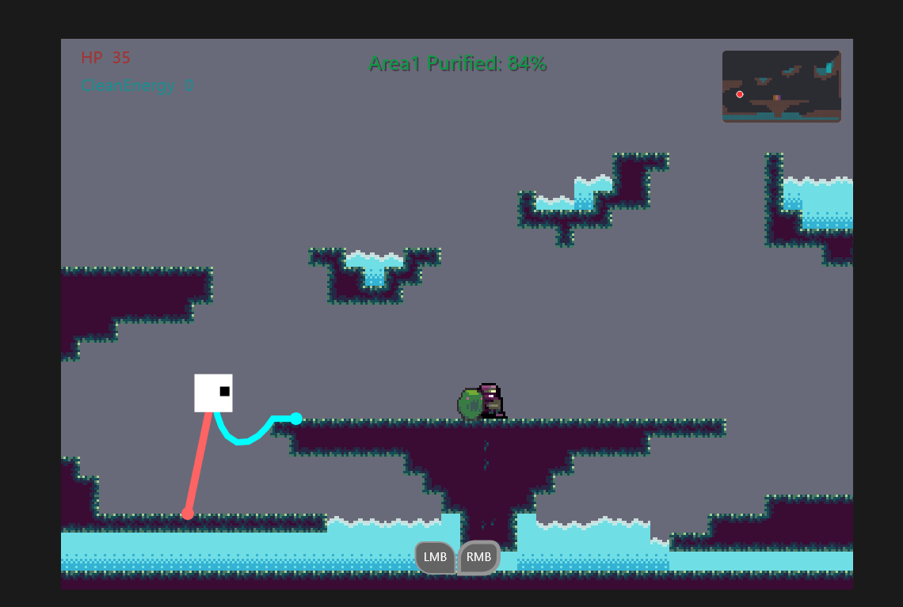
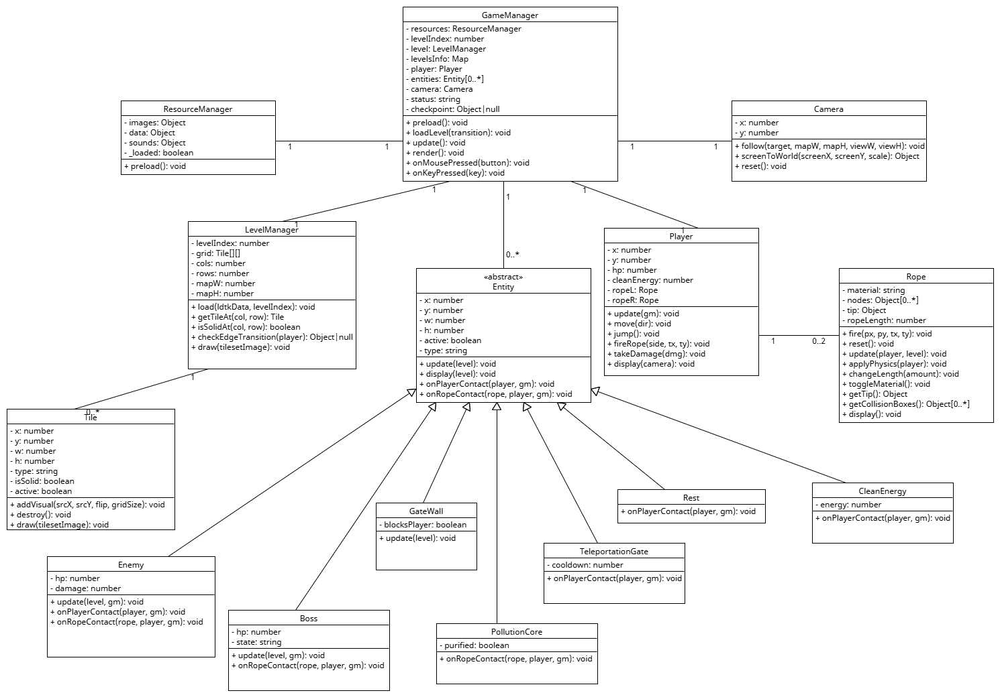
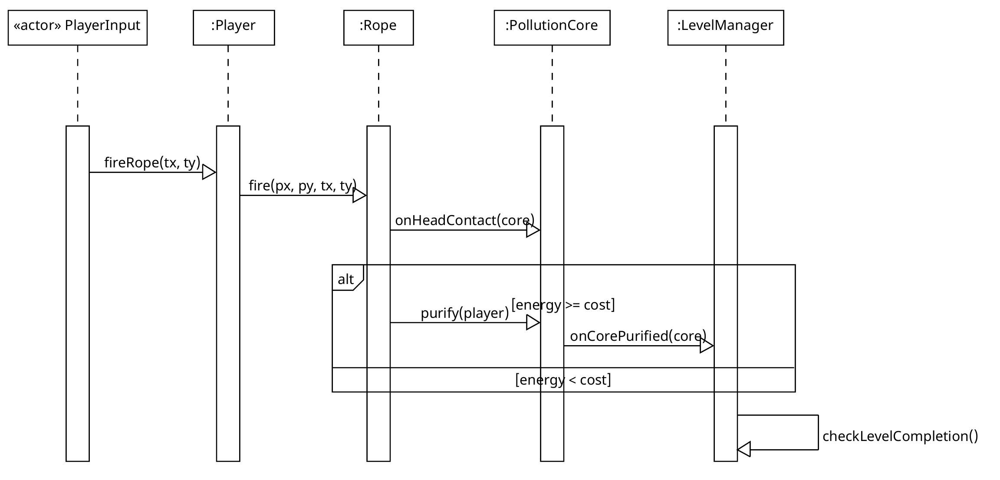

# 2026-group-6
2026 COMSM0166 group 6

## KanBan Link
https://comsm0166-group6.atlassian.net/jira/software/projects/KAN/boards/1

## Echoes of Purity

### description
This is a non-linear level-based game that combines side-scrolling platforming, puzzle-solving, and lightweight RPG elements, with the core theme of "purifying pollution and ecological restoration." Players use rope tools to delve into highly polluted areas, gradually restoring the planet's ecology. Different levels of purification completion will determine the future direction and the end of the world. 

### demo image: v2.5

(updated in 03/03/26)

  

### TRY TO START GAME

  <a href = "https://uob-comsm0166.github.io/2026-group-6/"> Start Game </a>

VIDEO. Include a demo video of your game here (you don't have to wait until the end, you can insert a work in progress video)

<table>
  <tr>
    <td>Attack monster</td>
    <td>Energy Supply</td>
  </tr>
  <tr>
    <td>Purify pollutoncore</td>
    <td>Set a save point and restore hp</td>
  </tr>
  <tr>
    <td>Ropemechanics</td>
  </tr>
</table>

## Your Group

  

| Name | Github-Username | Email | Role |
|------|----------|-------|------|
| Qizhou Lu | qizhoul888-crypto | ah25177@bristol.ac.uk | Backend method implementation, mechanism implementation |
| Yifei Niu | yifeiniu0925 | sa25269@bristol.ac.uk | Game content design and requirement analysis, project manager |
| Mengzhou Gao | mengzhou168 | ti25314@bristol.ac.uk | Map and Level Design, Game detail design|
| Ruomu Lu | n-wind-ddd | co25180@bristol.ac.uk | Architecture, integrating front-end and back-end, core code development |
| Hang Su | chaofengming123 | fy25078@bristol.ac.uk | Front-end development, tester, analysis and planning of project progress |
| Jiaying Wang | jiaying2000wang | zb25795@bristol.ac.uk | UI design, feedback, experience, sound effects, summary meeting |

## Project Report
- [1. Introduction](#1-introduction)
- [2. Game Content](#2-game-content)
- [3. Requirements](#3-requirements)
- [4. Design](#4-design)
- [5. Implementation](#5-implementation)
- [6. Evaluation](#6-evaluation)
- [7. Process](#7-process)
- [8. Sustainability](#8-sustainability)
- [9. Conclusion](#9-conclusion)
- [10. Contribution Statement](#10-contribution-statement)
- [11. Additional Marks](#11-additional-marks)

## 1. Introduction

Echoes of Purity is a structured non-linear 2D level game that combines side-scrolling platform jumping and lightweight role-playing elements. The core theme of the game is "purifying pollution and ecological restoration". Players will use the rope tool to enter the highly polluted area and gradually restore the planet's ecology. Different levels of purification completion will determine the future direction and the end of the world.

The game is set on an alien planet on the verge of collapse due to long-term pollution. After severe environmental imbalance, the planet’s native civilization entered a dormant state. The possibility of restoring the planet's ecosystem remains uncertain.Players will take on the role of an advanced artificial intelligence purification unit sent to the severely polluted planet. Using rope tools and cleaning energy, they will penetrate various highly polluted areas, purify contaminated organisms and the environment, and gradually restore the planet's ecosystem.

As players advance through levels and complete purification objectives, the planet’s environmental structure, accessible routes, and ecological conditions gradually evolve. These changes reflect the player’s impact on the world and strengthen the restoration theme.

The final outcome of the game is determined by the player’s purification progress. Each area of the game has many pollution cores and enemies. Successfully purify at least 80% of the pollution cores and the enemies will reach the standard level of completion. Purifying all pollution cores and enemies unlocks a full restoration ending, representing complete ecological recovery.

## 2. Game Content

## 3. Requirements

### Stakeholder Analysis

In order to better identify the stakeholders involved or affected by the game, we conducted a stakeholder analysis of the game. The stakeholder onion model in Figure 1 shows different groups that are either involved or affected by the Echoes of Purity, organized according to their level of interaction with the system.

  

  <b>Figure 1.</b> Stakeholder Onion Model

### Ideation Process

  

<b>Figure 2.</b> Ideation process for the game design of <i>Echoes of Purity</i>.

### Reflection
In this project, our team progressively understood and mastered the roles of epics, user stories, and acceptance criteria in software engineering through the example of Running App in the workshop, and how they integrate with our game's context. Early in the project, frequent communication among team members led us to believe we had reached consensus on functional requirements, causing us to underestimate the necessity of formalized requirement descriptions.

This assumption was gradually corrected as requirements were systematically organized and discussed. Organizing requirements into epics enabled high-level, structured planning of game systems—such as the core purification mechanism, exploration and ability unlocking, and world state feedback with ending systems. This approach helped define system boundaries during design and maintain logical consistency between features.

User stories prompted us to reexamine requirements from diverse stakeholder perspectives: players, game designers, game developers, testers, and course instructors. The user-value-oriented description approach made us focus not only on what a feature “does”, but also why it “does it”. This clarified the game's core design theme: promoting sustainable development on a resource-limited planet through “purification”.

Acceptance criteria helped translate abstract design goals into concrete, verifiable, and testable behavioral standards. By defining clear conditions and expected outcomes, team members developed a more consistent understanding of implementation details, while also providing a clear basis for testing and evaluation.

As the game's scope expanded, requirements continued to evolve. Through the ongoing addition, adjustment, or removal of user stories, we optimized the requirements system in a more agile manner. This ensured that the final implemented features aligned with the game's theme while also meeting the course's requirements for testability and maintainability.

## 4. Design

- 15% ~750 words 
- System architecture. Class diagrams, behavioural diagrams. 
### Class Diagram

  

The class diagram illustrates the overall architecture of the game system. The `GameManager` acts as the central coordinator, managing the player, level progression, camera, and shared resources. The game world is organised through the `LevelManager`, which maintains the tile-based map structure and manages collections of entities derived from a common abstract `Entity` class.

Different gameplay objects, including `Enemy`, `Boss`, `PollutionCore`, `Rest`, and `CleanEnergy`, extend the Entity class and implement their own interaction behaviours. Among these, `PollutionCore`, `Enemy`, and `Boss` represent polluted elements in the environment that must be purified by the player.

The core gameplay mechanic is a purification system. The `Player` interacts with the environment and entities using two `Rope` objects, which enable movement, puzzle solving, and purification actions. For example, ropes can trigger the purification of `PollutionCore`, or interact with `Enem`y and `Boss` entities to gradually remove pollution and progress through the level.

Overall, the design follows object-oriented principles such as abstraction, inheritance, and modular decomposition, improving the extensibility and maintainability of the system.
### Sequence Diagram – Purify

  

The sequence diagram shows the process of purifying a pollution core using the rope system. Player input triggers the rope deployment, which interacts with a pollution core upon contact. An `alt` fragment is used to model the energy-dependent outcome of the purification attempt. Successful purification notifies the LevelManager, which checks whether enough pollution cores in the current area have been purified to allow level progression. If energy is insufficient, the purification attempt fails and no core state is changed.

## 5. Implementation

- 15% ~750 words

- Describe implementation of your game, in particular highlighting the TWO areas of *technical challenge* in developing your game.

## 6. Evaluation

- 15% ~750 words

- One qualitative evaluation (of your choice) 

- One quantitative evaluation (of your choice) 

- Description of how code was tested. 

## 7. Process 

- 15% ~750 words

- Teamwork. How did you work together, what tools and methods did you use? Did you define team roles? Reflection on how you worked together. Be honest, we want to hear about what didn't work as well as what did work, and importantly how your team adapted throughout the project.

## 8. Sustainability

## 9. Conclusion

- 10% ~500 words

- Reflect on the project as a whole. Lessons learnt. Reflect on challenges. Future work, describe both immediate next steps for your current game and also what you would potentially do if you had chance to develop a sequel.

## 10. Contribution Statement

- Provide a table of everyone's contribution, which *may* be used to weight individual grades. We expect that the contribution will be split evenly across team-members in most cases. Please let us know as soon as possible if there are any issues with teamwork as soon as they are apparent and we will do our best to help your team work harmoniously together.

## 11. Additional Marks

You can delete this section in your own repo, it's just here for information. in addition to the marks above, we will be marking you on the following two points:

- **Quality** of report writing, presentation, use of figures and visual material (5% of report grade) 
  - Please write in a clear concise manner suitable for an interested layperson. Write as if this repo was publicly available.
- **Documentation** of code (5% of report grade)
  - Organise your code so that it could easily be picked up by another team in the future and developed further.
  - Is your repo clearly organised? Is code well commented throughout?
