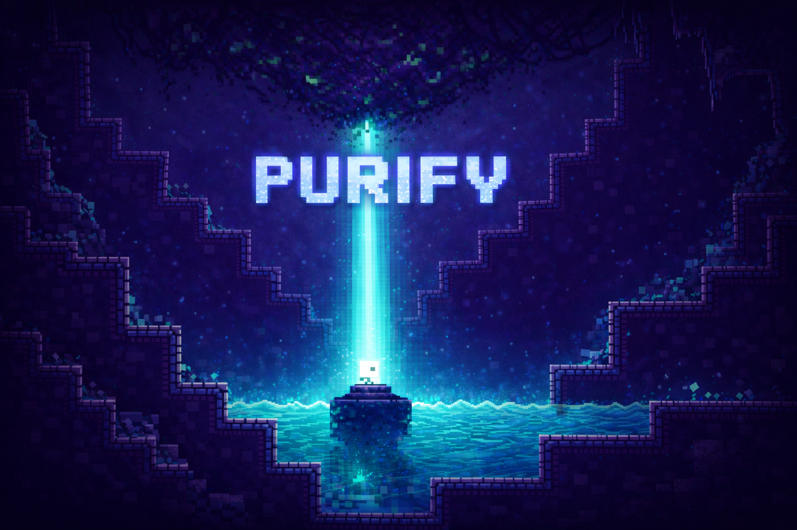
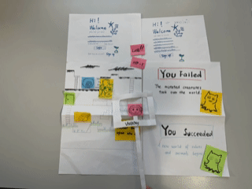
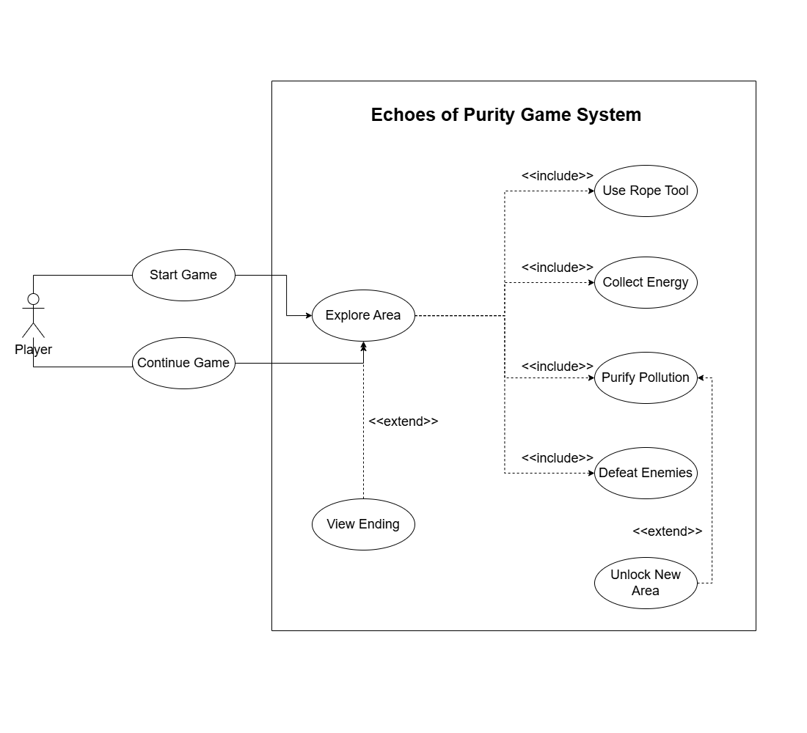
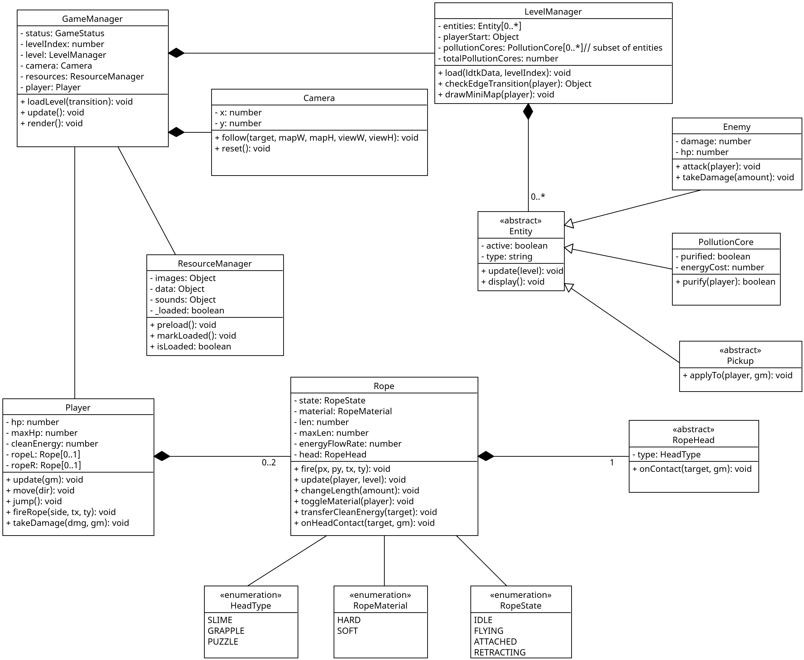
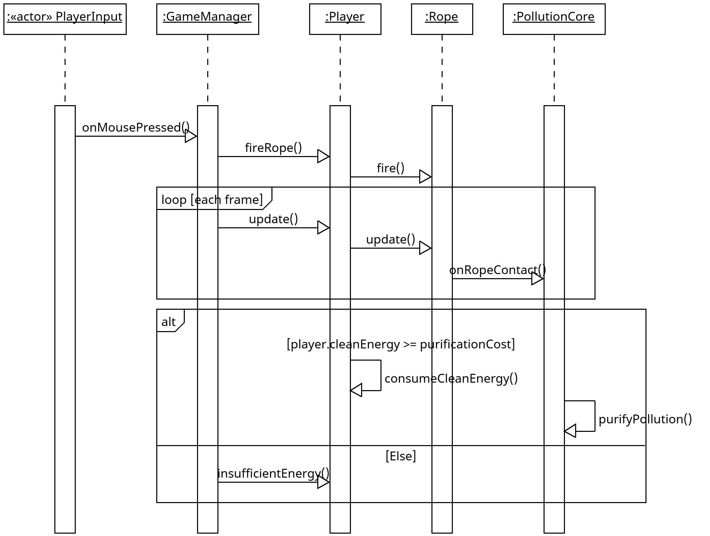

# 2026-group-6
2026 COMSM0166 group 6

# KanBan Link
https://comsm0166-group6.atlassian.net/jira/software/projects/KAN/boards/1

# Echoes of Purity

## description
This is a non-linear level-based game that combines side-scrolling platforming, puzzle-solving, and lightweight RPG elements, with the core theme of "purifying pollution and ecological restoration." Players use rope tools to delve into highly polluted areas, gradually restoring the planet's ecology. Different levels of purification completion will determine the future direction and the end of the world. 

## demo image: v2.5

  

## TRY TO START GAME

  <a href = "https://uob-comsm0166.github.io/2026-group-6/"> Start Game </a>

VIDEO. Include a demo video of your game here (you don't have to wait until the end, you can insert a work in progress video)

<table>
  <tr>
    <td>Attack monster</td>
    <td>Energy Supply</td>
  </tr>
  <tr>
    <td>Purify pollutioncore</td>
    <td>Set a save point and restore hp</td>
  </tr>
  <tr>
    <td>Ropemechanics</td>
  </tr>
</table>

# Your Group

  

| Name | Github-Username | Email | Role |
|------|----------|-------|------|
| Qizhou Lu | qizhoul888-crypto | ah25177@bristol.ac.uk | Backend method implementation, mechanism implementation |
| Yifei Niu | yifeiniu0925 | sa25269@bristol.ac.uk | Game content design and requirement analysis, project manager |
| Mengzhou Gao | mengzhou168 | ti25314@bristol.ac.uk | Map and Level Design, Game detail design|
| Ruomu Lu | n-wind-ddd | co25180@bristol.ac.uk | Architecture, integrating front-end and back-end, core code development |
| Hang Su | chaofengming123 | fy25078@bristol.ac.uk | Front-end development, tester, analysis and planning of project progress |
| Jiaying Wang | jiaying2000wang | zb25795@bristol.ac.uk | UI design, feedback, experience, sound effects, summary meeting |

# Project Report
- [1. Introduction](#1-introduction)
- [2. Game Content](#2-game-content)
- [3. Requirements](#3-requirements)
- [4. Design](#4-design)
- [5. Implementation](#5-implementation)
- [6. Evaluation](#6-evaluation)
- [7. Process](#7-process)
- [8. Sustainability](#8-sustainability)
- [9. Conclusion](#9-conclusion)
- [10. Contribution Statement](#10-contribution-statement)
- [11. Appendix](#11-appendix)
- [12.References](#12-references)

## 1. Introduction

Echoes of Purity is a structured non-linear 2D level game that combines side-scrolling platform jumping and lightweight role-playing elements. The core theme of the game is "purifying pollution and ecological restoration". Players will use the rope tool to enter the highly polluted area and gradually restore the planet's ecology. Different levels of purification completion will determine the future direction and the end of the world.

The game is set on an alien planet on the verge of collapse due to long-term pollution. After severe environmental imbalance, the planet’s native civilization entered a dormant state. The possibility of restoring the planet's ecosystem remains uncertain.Players will take on the role of an advanced artificial intelligence purification unit sent to the severely polluted planet. Using rope tools and cleaning energy, they will penetrate various highly polluted areas, purify contaminated organisms and the environment, and gradually restore the planet's ecosystem.

As players advance through levels and complete purification objectives, the planet’s environmental structure, accessible routes, and ecological conditions gradually evolve. These changes reflect the player’s impact on the world and strengthen the restoration theme.

The final outcome of the game is determined by the player’s purification progress. Each area of the game has many pollution cores and enemies. Successfully purify at least 80% of the pollution cores and the enemies will reach the standard level of completion. Purifying all pollution cores and enemies unlocks a full restoration ending, representing complete ecological recovery.

# 2. Game Content

# 3. Requirements

## Ideation

  

<b>Figure 1.</b> Ideation process for the design of <i>Echoes of Purity</i>.

In the early stage of the project, we explored game ideas through team brainstorming sessions. Each member first independently proposed a game concept, and then organized these initial ideas in the *gamelist* file of the project repository. This file was used to record different game types, core mechanisms, and potential design directions. By discussing and comparing these ideas, we found that the team members' interests mainly focused on game types that were more exploratory and had a non-linear structure, such as **Metroidvania**. Therefore, during the team discussions in the second and third weeks, we gradually narrowed down the creative direction. We decided to position the project as a non-linear 2D side-scrolling platform game. Players can freely explore different areas and advance the game by gradually unlocking paths.

Based on the determination of the game type, we then delved into the themes that the game intends to convey. We agreed that the game should not only provide an engaging interactive experience but also communicate a meaningful message. Considering the growing global concern about environmental pollution, we chose **environmental restoration and pollution purification** as the core theme of the game. As a result, we proposed a gameplay centered around purifying pollution sources: Players need to remove pollution sources (such as garbage or pollution cores) in the game world, gradually restoring the environment.

  

  <b>Figure 2.</b> Paper Prototypin

In the third-week lab session, we further explored and evaluated our concept by creating a paper prototype of the game. This approach enables low-cost experimentation, making it easier to gather feedback and refine ideas before implementing the system in code. Through this prototype, we were able to visually understand the core gameplay loop, thereby enhancing our comprehension of the player interaction process. This was helpful in guiding the subsequent design and development phases.

## Stakeholder Analysis

In order to better identify the stakeholders involved or affected by the game, we conducted a stakeholder analysis of the project. Following the stakeholder taxonomy proposed by Alexander (2005), we adopted the stakeholder onion model to structure and visualise the different stakeholder groups related to the system. This model helps identify stakeholders based on their relationship and level of interaction with the system, enabling the development team to better understand the project context and stakeholder influence.

  

  <b>Figure 3.</b> Stakeholder Onion Model

To structure our game requirements, we organised them using **epics, user stories, and acceptance criteria**, following the agile requirements format introduced in the lab and lecture.

<table>
<tr>
<th>Epic</th>
<th>User Story</th>
<th>Acceptance Criterion</th>
</tr>

<tr>
<td rowspan="2">Exploration and Traversal</td>
<td>As a player, I want to use a rope tool to traverse difficult terrain so that I can explore polluted areas of the planet.</td>
<td>Given the player is near a rope anchor point, when they activate the rope tool, then the player can swing or climb to reach higher or distant platforms.</td>
</tr>

<tr>
<td>As a player, I want to explore interconnected areas so that I can gradually uncover the world.</td>
<td>Given the player moves through the environment, when they reach a transition point between areas, then the camera follows the player and loads the connected area smoothly.</td>
</tr>

<tr>
<td rowspan="2">Pollution Purification</td>
<td>As a player, I want to purify polluted creatures and cores so that the environment can gradually recover.</td>
<td>Given a polluted creature or core is present, when the player uses cleaning energy, then the pollution entity is removed and the purification progress increases.</td>
</tr>

<tr>
<td>As a player, I want to purify polluted creatures and pollution cores so that I can clear obstacles in my path.</td>
<td>Given a polluted creature or pollution core is present, when the player uses cleaning energy to purify it, then the entity disappears and the path becomes accessible.</td>
</tr>

<tr>
<td rowspan="2">Progression and World State</td>
<td>As a player, I want purification progress to unlock new areas so that exploration feels rewarding.</td>
<td>Given the purification progress reaches a required percentage, when the player approaches a blocked path, then the barrier is removed or a gate opens.</td>
</tr>

<tr>
<td>As a player, I want the final ending to depend on how much pollution I cleaned so that my choices influence the outcome.</td>
<td>Given the player completes the game, when the system evaluates the purification percentage, then the corresponding ending is displayed.</td>
</tr>

<tr>
<td rowspan="2">Player Feedback and UI</td>
<td>As a player, I want to see my purification progress so that I understand how much of the world has been restored.</td>
<td>When the player is in the game interface, the percentage of the world's purification will be displayed.</td>
</tr>

<tr>
<td>As a player, I want clear visual feedback when I purify something so that I understand my actions had an effect.</td>
<td>Given the player purifies an enemy or pollution core, when the purification completes, then a visual effect and sound cue are triggered.</td>
</tr>

</table>

<strong>Table 1.</strong> Epics, user stories and acceptance criteria used in <em>Echoes of Purity</em> development

## Reflection
In this project, our team progressively understood and mastered the roles of epics, user stories, and acceptance criteria in software engineering through the example of Running App in the workshop, and how they integrate with our game's context. Early in the project, frequent communication among team members led us to believe we had reached consensus on functional requirements, causing us to underestimate the necessity of formalized requirement descriptions.

This assumption was gradually corrected as requirements were systematically organized and discussed. Organizing requirements into epics enabled high-level, structured planning of game systems—such as the core purification mechanism, exploration and ability unlocking, and world state feedback with ending systems. This approach helped define system boundaries during design and maintain logical consistency between features.

User stories prompted us to reexamine requirements from diverse stakeholder perspectives: players and development team members. The user-value-oriented description approach made us focus not only on what a feature “does”, but also why it “does it”. This clarified the game's core design theme: promoting sustainable development on a resource-limited planet through “purification”.

Acceptance criteria helped translate abstract design goals into concrete, verifiable, and testable behavioral standards. By defining clear conditions and expected outcomes, team members developed a more consistent understanding of implementation details, while also providing a clear basis for testing and evaluation.

As the game's scope expanded, requirements continued to evolve. Through the ongoing addition, adjustment, or removal of user stories, we optimized the requirements system in a more agile manner. This ensured that the final implemented features aligned with the game's theme while also meeting the course's requirements for testability and maintainability.

## Use-Cases

To better understand how players interact with the game system, we model the main functional interactions using a UML Use Case diagram. By identifying the main participants (players) and key game activities such as exploration, purification and progression, this model provides our team with a structured overview of the system's behavior. This kind of diagram helps to ensure that the main game features are systematically captured, improves communication among team members, and supports consistency between requirements, design decisions and implementation. In addition, a detailed use-case specification is provided in the [Appendix](#11-appendix).

  

  <b>Figure 4. Use-Case Diagram</b>

# 4. Design

- 15% ~750 words 
- System architecture. Class diagrams, behavioural diagrams.

### 4.1 System Architecture

This system employs a modular, object-oriented architecture centred around the `GameManager`, which coordinates interactions between subsystems during gameplay. The overall architecture divides game logic into several independent modules, including game control, level management, entity systems, and resource management, thereby enhancing the system's maintainability and scalability.

During gameplay, the `GameManager` maintains the overall game state and schedules module execution within each frame's update loop. For instance, it updates current game logic, invokes the level management module to refresh level content, and controls screen refreshes. This centralised scheduling mechanism ensures unified progression of game logic per frame.

Resource loading is centrally managed by the `ResourceManager`, while level structure and in-level objects are maintained by the `LevelManager`. By separating these functional modules from core control logic, the system gains greater flexibility in supporting multi-level structures and area transitions. 

### 4.2 Initial Class Diagram

After identifying the user's core requirements, we designed the system's initial class structure. The initial design primarily revolves around the core components essential for game operation, and Figure X illustrates this initial class diagram.

  

  <b>Figure X. Initial Class Diagram</b>

#### 1. GameManager
`GameManager` serves as the system's central control class, responsible for maintaining key components required for game operation, such as `LevelManager`, `Camera`, `ResourceManager`, and `Player`. This class governs the game flow by invoking methods like loadLevel(), update(), and render(), coordinating component updates and rendering within each frame.

#### 2. LevelManager
`LevelManager` loads level data and manages entities within the current level. It maintains an entity collection to store all objects in the level. Additionally, `LevelManager` detects map boundaries and triggers area transitions when necessary.

#### 3. Player
Player-related logic is implemented by `Player`. This class encapsulates attributes such as the player's health, maximum health, and purification energy, whilst providing functions for movement, jumping, and firing ropes. Players can interact with environmental objects through the rope system.

#### 4. Rope
The rope mechanism is implemented by `Rope`. This class manages rope state, length, and energy transfer behaviours, providing methods for deploying ropes, updating rope state, and adjusting length. Each rope associates with a `RopeHead` object to handle interaction logic when the rope head contacts target objects.

#### 5. Entity
To centrally manage interactive objects within levels, the system employs the abstract class `Entity`. Different game object types inherit from this class to implement specific behaviours. For instance, `Enemy` represents hostile characters, while `PollutionCore` denotes environmental targets requiring purification. This inheritance structure enables shared interfaces across objects while preserving distinct behavioural logic.

This foundational design establishes the game's core operational framework, providing a basis for subsequent system functionality expansion.

### 4.3 Final Class Diagram

As development progressed, the game gradually added more features, such as enemy types, environmental interaction objects, and area teleportation mechanisms. To support these new features, the system architecture was further expanded. The final class diagram (Figure X) illustrates the relationships between the main classes in the system.

  

  <b>Figure X. Final Class Diagram</b>

In the final design, `Entity` became the core abstract class of the game object system, extending into several subclasses, such as `Enemy`, `Boss`, `PollutionCore`, `TeleportationGate`, `CleanEnergy`, and `GateWall`. These classes represent different types of game objects and implement their respective interactive behaviors. For example, `Enemy` and `Boss` are used to implement enemy characters, while `CleanEnergy` represents resource objects that players can collect.

Furthermore, the level system was optimized. `LevelManager` uses a `Tile` grid structure to represent the map environment, with each tile recording its position, size, and whether it is solid terrain. This grid-based structure makes level loading, collision detection, and map rendering more efficient.

Finally, the interaction methods between entities have also been standardized. When a player or rope comes into contact with an entity, the interaction methods defined by that entity are called, such as onPlayerContact() or onRopeContact(). Different entities can implement different behaviors based on their own type, such as restoring player resources, triggering teleportation, or updating the polluted core state. This polymorphic interaction method reduces coupling between systems and makes it easier to add new entity types to the system.

### 4.4 Pollution Purification Sequence Diagram
Figure X shows the player's interaction process for purifying the contaminated core via the rope system. This sequence diagram depicts the primary system interaction flow from player input to the purification of the contaminated core.

  

  <b>Figure X. Rope Interaction and Pollution Purification</b>

When the player performs an input action, the input event is first received by the GameManager, triggering the fireRope() method. Subsequently, the Player calls the Rope's fire() method, causing the rope to be fired towards the target direction.

During each frame update loop, the GameManager continuously calls the Player's update() method, which in turn updates the Rope's state. When the rope contacts an environmental object, it triggers the target object's onRopeContact() method. In this instance, contact with the PollutionCore initiates the pollution purification logic.

If the player's current purification energy satisfies the purification conditions (player.cleanEnergy ≥ purificationCost), the player first expends the corresponding energy. Subsequently, the PollutionCore executes the purifyPollution() method and updates its state. Otherwise, the system triggers the insufficient energy handling logic, maintaining the PollutionCore's current state unchanged.

### 4.5 Unlock New Area Sequence Diagram
Figure X shows the interaction flow for unlocking new areas. This sequence diagram describes how the system determines whether to unlock new game areas based on the player's purification progress, i.e., purification percentage.

  

  <b>Figure X. Unlock New Area</b>

During gameplay, the GameManager calls the Player's update() method within each frame's update loop to continuously refresh the player's state. Concurrently, the system invokes the LevelManager's checkUnlockCondition() method to assess whether the unlock criteria are currently met.

Should the player's purification progress meet the preset requirement (purifiedProgress ≥ requiredProgress), the system triggers the unlockNewArea() method to unlock the new area. Subsequently, the GameManager loads the new level data and invokes the loadNewArea() method to complete the area transition.

Upon completion of the new area's loading, the system resets the player's position via the resetPosition() method to ensure correct entry into the new zone. Should the unlock conditions remain unmet, the system maintains the current state and continues executing the game loop.

# 5. Implementation

- 15% ~750 words

- Describe implementation of your game, in particular highlighting the TWO areas of *technical challenge* in developing your game.

# 6. Evaluation

- 15% ~750 words

- One qualitative evaluation (of your choice) 

- One quantitative evaluation (of your choice) 

- Description of how code was tested. 

# 7. Process 

- 15% ~750 words

- Teamwork. How did you work together, what tools and methods did you use? Did you define team roles? Reflection on how you worked together. Be honest, we want to hear about what didn't work as well as what did work, and importantly how your team adapted throughout the project.

# 8. Sustainability

# 9. Conclusion

- 10% ~500 words

- Reflect on the project as a whole. Lessons learnt. Reflect on challenges. Future work, describe both immediate next steps for your current game and also what you would potentially do if you had chance to develop a sequel.

# 10. Contribution Statement

- Provide a table of everyone's contribution, which *may* be used to weight individual grades. We expect that the contribution will be split evenly across team-members in most cases. Please let us know as soon as possible if there are any issues with teamwork as soon as they are apparent and we will do our best to help your team work harmoniously together.

# 11. Appendix

## **Use Case Specification**

**System:** *Echoes of Purity*

### **UC-01: Explore Polluted Area**

**Primary Actor**  
Player  

**Goal**  
Allow the player to explore interconnected areas of the game world and discover polluted zones that require purification.

**Stakeholders**

- Player – wants to explore the world and access new areas.
- Game system – maintains world state, environment loading, and player position.

**Preconditions**

1. The game session has started or a saved game has been loaded.
2. The player character is present in a playable area of the map.

**Trigger**

The player provides keyboard controls to move the character.

**Main Success Scenario**

1. The player moves the character using directional controls.
2. The game system updates the character’s position in the current area.
3. The camera follows the player as they traverse the environment.
4. When the player reaches the boundary of a connected area, the system loads the next area.
5. The player continues exploration within the new area.

**Alternative Flows**

**A1 – Area Locked by Pollution**

1. The player reaches a blocked passage or polluted gate.
2. The system checks purification progress.
3. If the purification condition is not satisfied, the passage remains inaccessible.

**A2 – Player Falls or Cannot Reach Platform**

1. The player attempts to traverse terrain but fails.
2. The character returns to a reachable platform.
3. The player continues exploration.

**Postconditions**

- The player may discover polluted entities, purification cores, or new traversal paths.
- The current world state and player position are updated.

### **UC-02: Purify Pollution Entities**

**Primary Actor**  
Player  

**Goal**  
Allow the player to remove pollution from enemies or environmental cores to restore parts of the ecosystem.

**Stakeholders**

- Player – wants to restore the environment and progress through the game.
- Game system – tracks pollution entities and purification progress.

**Preconditions**

1. The player is located near a pollution entity or pollution core.
2. The player has access to purification energy.

**Trigger**

The player activates the purification ability.

**Main Success Scenario**

1. The player targets a polluted entity or core.
2. The player activates cleaning energy.
3. The purification action is executed.
4. The pollution entity is removed or transformed.
5. The global purification progress value increases.
6. Visual feedback reflects the purification result.

**Alternative Flows**

**A1 – Target Out of Range**

1. The player activates purification.
2. The system detects no valid target.
3. The action fails and no purification occurs.

**A2 – Interrupted Purification**

1. The player begins purification.
2. The player moves away or stops the action.
3. The purification process is cancelled.

**Postconditions**

- The polluted entity or core is removed or transformed.
- The world’s purification progress is updated.

# . Additional Marks

You can delete this section in your own repo, it's just here for information. in addition to the marks above, we will be marking you on the following two points:

- **Quality** of report writing, presentation, use of figures and visual material (5% of report grade) 
  - Please write in a clear concise manner suitable for an interested layperson. Write as if this repo was publicly available.
- **Documentation** of code (5% of report grade)
  - Organise your code so that it could easily be picked up by another team in the future and developed further.
  - Is your repo clearly organised? Is code well commented throughout?

 # 12. References

Alexander, I. F. (2005). *A taxonomy of stakeholders: Human roles in system development*. International Journal of Technology and Human Interaction, 1(1), 23–59.

