# 2026-group-6
2026 COMSM0166 group 6

# KanBan Link
[Our KanBan](https://comsm0166-group6.atlassian.net/jira/software/projects/KAN/boards/1)

# Echoes of Purity

  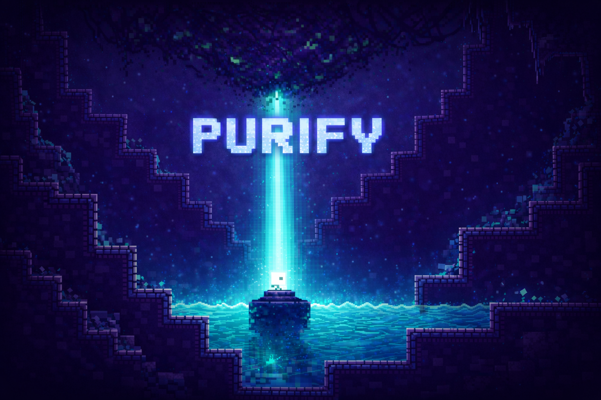

  <strong>
    <a href="https://youtu.be/0P7ryCOJrmw">
      👉 Click here to watch our video!
    </a>
  </strong>

## TRY TO START GAME

  

  <a href="https://uob-comsm0166..io/2026-group-6/" style="font-size:18px; margin: 0 10px;">
    Start Game
  </a>

  

<table>
  <tr>
    <td>Attack Monster</td>
    <td>Energy Supply</td>
  </tr>
  <tr>
    <td>Purify Pollutioncore</td>
    <td>Set a Save Point and Restore HP</td>
  </tr>
  <tr>
    <td>Ropemechanics</td>
  </tr>
</table>

# Your Group

  

| Name | Github-Username | Email | Role |
|------|----------|-------|------|
| Qizhou Lu | qizhoul888-crypto | ah25177@bristol.ac.uk | Backend Method Implementation, Mechanism Implementation |
| Yifei Niu | yifeiniu0925 | sa25269@bristol.ac.uk | Game Content Design and Requirement Analysis, Project Manager |
| Mengzhou Gao | mengzhou168 | ti25314@bristol.ac.uk | Map and Level Design, Game Detail Design|
| Ruomu Lu | n-wind-ddd | co25180@bristol.ac.uk | Architecture, Integrating Front-end and Back-end, Core Code Development |
| Hang Su | chaofengming123 | fy25078@bristol.ac.uk | Front-end Development, Tester, Analysis and Planning of Project Progress |
| Jiaying Wang | jiaying2000wang | zb25795@bristol.ac.uk | UI Design, Feedback, Experience, Sound Effects, Summary Meeting |

# Project Report
- [1. Introduction](#1-introduction)
- [2. Game Content](#2-game-content)
- [3. Requirements](#3-requirements)
- [4. Design](#4-design)
- [5. Implementation](#5-implementation)
- [6. Evaluation](#6-evaluation)
- [7. Process](#7-process)
- [8. Sustainability](#8-sustainability)
- [9. Conclusion](#9-conclusion)
- [10. Contribution Statement](#10-contribution-statement)
- [11. AI statement](#11-ai-statement)
- [12. Appendix](#12-appendix)
- [13. References](#13-references)

# 1. Introduction
Echoes of Purity is a structured non-linear 2D level game that combines side-scrolling platform jumping and lightweight role-playing elements. The game focuses on the core theme of the game is "purifying pollution and ecological restoration". 

The game is set on an alien planet on the verge of collapse due to long-term pollution. After severe environmental imbalance, the planet’s native civilization entered a dormant state. The possibility of restoring the planet's ecosystem remains uncertain.Players will take on the role of an advanced artificial intelligence purification unit sent to the severely polluted planet. Using rope tools and cleaning energy, they will penetrate various highly polluted areas, purify contaminated organisms and the environment, and gradually restore the planet's ecosystem.

The twist of this game lies in the combination of its "dynamic ecological feedback system" and the progress mechanism. As players advance through levels and complete purification objectives, the planet’s environmental structure, accessible routes, and ecological conditions gradually evolve visually (Figure 1). These visual changes better reflect the impact that players have on the world and echoe the concept of sustainable development in reality to a certain extent.

Under this system, players do not need to completely remove pollution. When the purification value of a certain area reaches 75%, they can enter the next area and the ecosystem has been restored (Figure 1). However, the unpurified part will continue to affect the overall ecological state and will eventually be reflected in the outcome of the planet. This makes the game form a tension between "efficiency promotion" and "thorough purification" - every player's choice not only affects the progress of the level, but also constantly shapes the final form of the planet.

  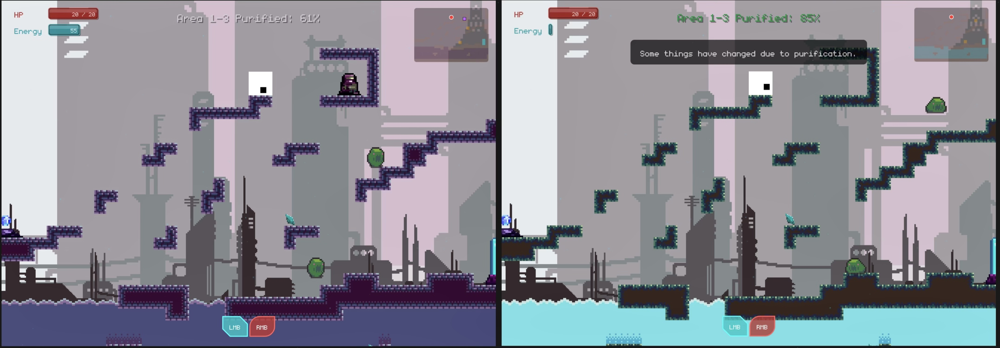

  <b>Figure 1.</b> Ecological Restoration After Reaching 75% Purification (Left: Before, Right: After)

# 2. Game Content

<table>
<tr>
<th>Category</th>
<th>Name</th>
<th>Image</th>
<th>Description</th>
</tr>

<tr>
<td>Player</td>
<td>Robot</td>
<td></td>
<td>The player's image is a white robot with the ability to purify.</td>
</tr>

<tr>
<td>Ability</td>
<td>Energy Rope</td>
<td></td>
<td>The rope can help players purify the pollution and traverse difficult terrain.</td>
</tr>

<tr>
<td rowspan="3">Interactable</td>
<td>Energy Pillar</td>
<td>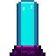</td>
<td>Players can obtain purification energy here.</td>
</tr>

<tr>
<td>Button</td>
<td></td>
<td>The button can open the mechanism door.</td>
</tr>

<tr>
<td>EndingButton</td>
<td></td>
<td>After the player presses it, different endings will be triggered according to different total area purification progress.</td>
</tr>

<tr>
<td>Checkpoint</td>
<td>Respawn Point</td>
<td></td>
<td>The player's resurrection point</td>
</tr>

<tr>
<td>Objective</td>
<td>Pollution Source</td>
<td>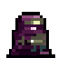</td>
<td>A pollution core that need to be purified by the players.</td>
</tr>

<tr>
<td>Enemy</td>
<td>Monster</td>
<td>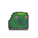</td>
<td>It will attack players and can be purified.</td>
</tr>

<tr>
<td rowspan="2">Gate</td>
<td>Area Gate</td>
<td></td>
<td>A gate between areas that opens when the area's purification level reaches 75%.</td>
</tr>

<tr>
<td>Mechanism Door</td>
<td></td>
<td>A door inside the area that opens after pressing a button.</td>
</tr>

<tr>
<td rowspan="2">Environment</td>
<td>Polluted Water</td>
<td></td>
<td>Deadly polluted water that kills the player on contact.</td>
</tr>

<tr>
<td>Clean Water</td>
<td></td>
<td>Safe water that does not harm the player.</td>
</tr>

<tr>
<td>Collectible</td>
<td>Energy Crystal</td>
<td></td>
<td>Scattered crystals, the blue ones can restore the player's purification energy. There are five colors of crystals in total, each with different effects when picked up.</td>
</tr>

</table>

# 3. Requirements

## Ideation

  

<b>Figure 2.</b> Ideation Process for the Design of <i>Echoes of Purity</i>

In the early stage of the project, we explored game ideas through team brainstorming sessions. Each member first independently proposed a game concept, and then organized these initial ideas in the *gamelist* file of the project repository. This file was used to record different game types, core mechanisms, and potential design directions. By discussing and comparing these ideas, we found that the team members' interests mainly focused on game types that were more exploratory and had a non-linear structure, such as **Metroidvania**. Therefore, during the team discussions in the second and third weeks, we gradually narrowed down the creative direction. We decided to position the project as a non-linear 2D side-scrolling platform game. Players can freely explore different areas and advance the game by gradually unlocking paths.

Based on the determination of the game type, we then delved into the themes that the game intends to convey. We agreed that the game should not only provide an engaging interactive experience but also communicate a meaningful message. Considering the growing global concern about environmental pollution, we chose **environmental restoration and pollution purification** as the core theme of the game. As a result, we proposed a gameplay centered around purifying pollution sources: Players need to remove pollution sources (such as garbage or pollution cores) in the game world, gradually restoring the environment.

  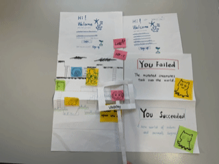

  <b>Figure 3.</b> Paper Prototypin

In the third-week lab session, we further explored and evaluated our concept by creating a paper prototype of the game. This method enables us to gather some feedback before the idea is implemented, and it can also further assist us in improving the design of the game. Through this prototype, we can gain a clear and intuitive understanding of the core gameplay process of the game, thereby deepening our comprehension of the player interaction process. This was helpful in guiding the subsequent design and development phases.

## Stakeholder Analysis

In order to better identify the stakeholders involved or affected by the game, we conducted a stakeholder analysis of the project. Following the stakeholder taxonomy proposed by Alexander (2005), we adopted the stakeholder onion model to structure and visualise the different stakeholder groups related to the system. This model helps identify stakeholders based on their relationship and level of interaction with the system, enabling the development team to better understand the project context and stakeholder influence.

  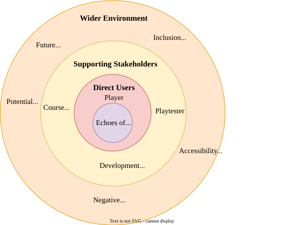

  <b>Figure 4.</b> Stakeholder Onion Model

To structure our game requirements, we organised them using **epics, user stories, and acceptance criteria**, following the agile requirements format introduced in the lab and lecture.

<strong>Table 1.</strong> Epics, User Stories and Acceptance Criteria Used in <em>Echoes of Purity</em> Development

<table>
<tr>
<th>Epic</th>
<th>User Story</th>
<th>Acceptance Criterion</th>
</tr>

<tr>
<td rowspan="2">Exploration and Traversal</td>
<td>As a player, I want to use a rope tool to traverse difficult terrain so that I can explore polluted areas of the planet.</td>
<td>Given the player is near a rope anchor point, when they activate the rope tool, then the player can swing or climb to reach higher or distant platforms.</td>
</tr>

<tr>
<td>As a player, I want to explore interconnected areas so that I can gradually uncover the world.</td>
<td>Given the player moves through the environment, when they reach a transition point between areas, then the camera follows the player and loads the connected area smoothly.</td>
</tr>

<tr>
<td rowspan="2">Pollution Purification</td>
<td>As a player, I want to purify polluted creatures and cores so that the environment can gradually recover.</td>
<td>Given a polluted creature or core is present, when the player uses cleaning energy, then the pollution entity is removed and the purification progress increases.</td>
</tr>

<tr>
<td>As a player, I want to purify polluted creatures and pollution cores so that I can clear obstacles in my path.</td>
<td>Given a polluted creature or pollution core is present, when the player uses cleaning energy to purify it, then the entity disappears and the path becomes accessible.</td>
</tr>

<tr>
<td rowspan="2">Progression and World State</td>
<td>As a player, I hope that the purification process can unlock new areas, so that the exploration process will make people feel a sense of achievement.</td>
<td>Given the purification progress reaches a required percentage, when the player approaches a blocked path, then the barrier is removed or a gate opens.</td>
</tr>

<tr>
<td>As a player, I hope that the final outcome of the game depends on how many contaminated cores I have cleared. In this way, my choices will be able to influence the result of the game.</td>
<td>Given the player completes the game, when the system evaluates the purification percentage, then the corresponding ending is displayed.</td>
</tr>

<tr>
<td rowspan="2">Player Feedback and UI</td>
<td>As a player, I want to see my purification progress so that I understand how much of the world has been restored.</td>
<td>When the player is in the game interface, the percentage of the world's purification will be displayed.</td>
</tr>

<tr>
<td>As a player, I want clear visual feedback when I purify something so that I understand my actions had an effect.</td>
<td>Given the player purifies an enemy or pollution core, when the purification completes, then a visual effect and sound cue are triggered.</td>
</tr>

</table>

## Reflection
In this project, our team progressively understood and mastered the roles of epics, user stories, and acceptance criteria in software engineering through the example of Running App in the workshop, and how they integrate with our game's context. Early in the project, frequent communication among team members led us to believe we had reached consensus on functional requirements, causing us to underestimate the necessity of formalized requirement descriptions.

Based on the content of the workshop, we divided the requirements into different Epics, which enabled our team to plan the game system at a higher level. For instance, the core purification mechanism and the design of players' exploration of the map. This can help us more clearly define the boundaries of the system during the design process and maintain logical consistency.
During the process of writing user stories, our team began to redesign the requirements from the perspectives of different stakeholders. And this user-value-centered approach enables us to further ponder the question of "why this function needs to be implemented like this". This further clarifies the overall theme of the game, which is to demonstrate the concept of sustainable development on a planet with limited resources through the "purification" mechanism. This further clarifies the theme of the game, which is about ecological protection and the concept of sustainable development. Meanwhile, acceptance criteria can help us transform the abstract design goals into specific and verifiable behavioral standards.

## Use-Cases

In order to understand the players' behaviors in the game and the interaction between them and the system, we use UML use case diagrams to analyze the main functions of the game. This diagram focuses on the players as the main participants and incorporates several core activities within the game, such as exploring the map, purifying pollution sources, and advancing the game progress, etc. In this way, our team can have a more intuitive understanding of the overall structure of the game system and the relationships between different functions. At the same time, this also provides a reference for the team members during the development process, which helps everyone to have a clearer discussion on the system design. For more detailed explanations of each use case, we have provided further information in the [Appendix](#11-appendix).

  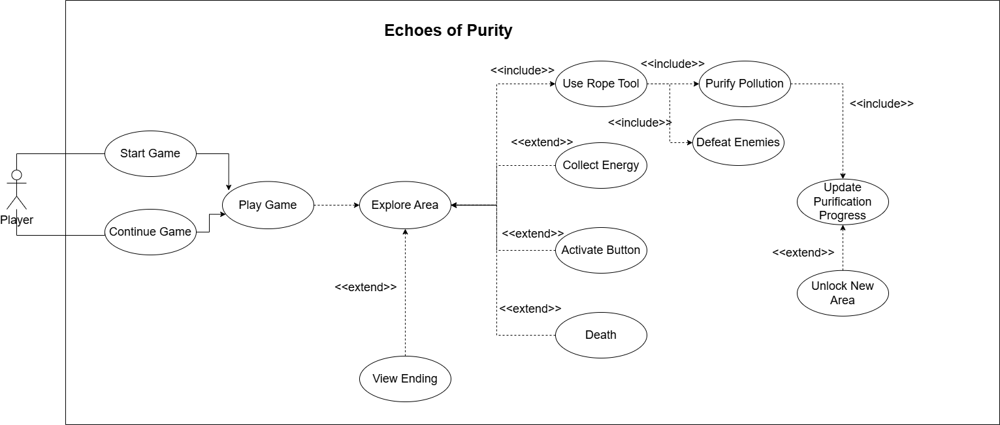

  <b>Figure 5.</b> Use-Case Diagram

# 4. Design

## 4.1 System Architecture
We employs a modular, object-oriented architecture centred around the `GameManager`, which coordinates interactions between sub-systems during the game process. The overall architecture divides game logic into several independent modules. The `GameManager` is responsible for maintaining the overall game state and scheduling module execution within each frame's update loop. The `LevelManager` maintains the level structure and objects, while resource loading is centrally handled by the `ResourceManager`. By separating these functional modules from the control logic, the system gains greater flexibility.

## 4.2 Initial Class Diagram
We defined the core user requirements and designed the initial class diagram of the system (Figure 6).

  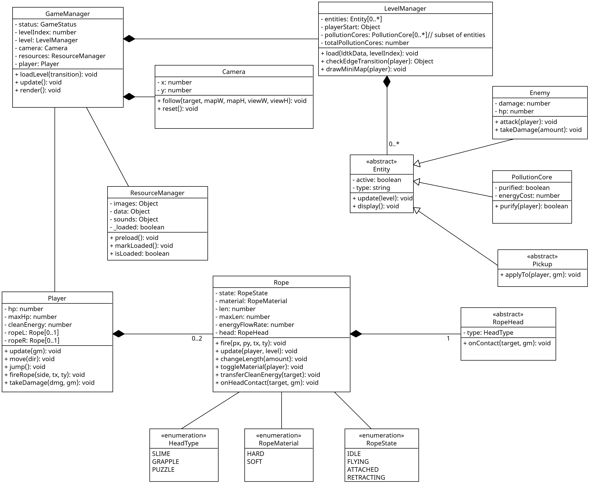

  <b>Figure 6.</b> Initial Class Diagram

Table 2 below summarizes the main classes in the system and their responsibilities.

  <b>Table 2.</b> Core Class Responsibilities

| Class | Description | Key Responsibilities |
|:------|:------------|:----------------------|
| **GameManager** | Central control class | Coordinates core components, maintains game state, and controls the game loop by calling `loadLevel()`, `update()`, and `render()` each frame |
| **LevelManager** | Level and entity manager | Loads level data, manages entities, detects boundaries, and handles level transitions |
| **Player** | Player logic and state | Manages health and energy, handles movement and jumping, and interacts via the rope system |
| **Rope** | Rope mechanism | Controls rope deployment, updates state, adjusts length, and coordinates interactions |
| **RopeHead** | Rope interaction handler | Defines how the rope interacts with target objects upon contact |
| **Entity (Abstract)** | Base class for objects | Provides a shared interface and supports extensibility for game entities |
| **ResourceManager** | Resource handler | Loads, stores, and provides access to game assets |
| **Camera** | Game view controller | Controls the visible area and follows the player |

## 4.3 Final Class Diagram
As game development progressed, we gradually added more features. To support these new features, the system architecture was also adjusted accordingly. Figure 7 represents our final class diagram.

  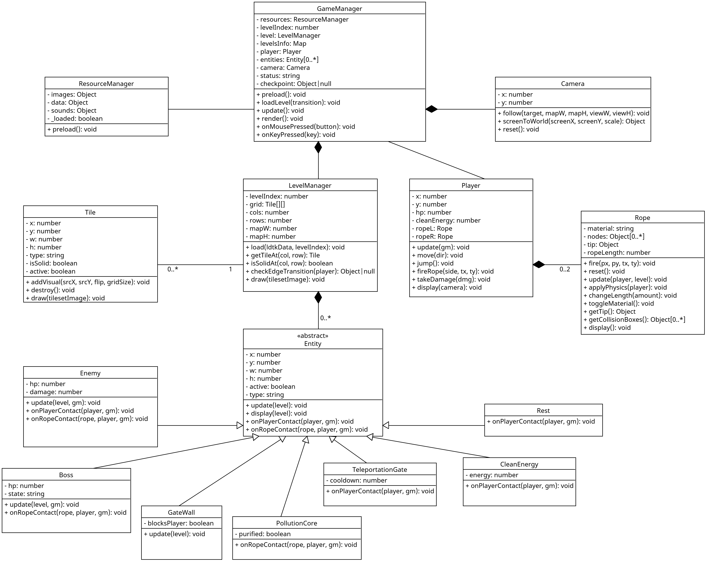

  <b>Figure 7.</b> Final Class Diagram

The main improvements to the system are reflected in the following three aspects.

Firstly, we have carried out the expansion work for the design of the entity system. In the initial class diagram design, the `Entity` only included a small number of basic subclasses. Now, the `Entity` is clearly defined as the core abstract class of the game object system, and it is extended into many concrete subclasses by inheritance, which include `Enemy`, `Boss`, `PollutionCore`, `TeleportationGate`, `CleanEnergy`, and `GateWal`l. This improvement makes different kinds of game objects can be managed under one unified structure.

Secondly, we have made the improvement upon the structure of `LevelManager`. The `LevelManager` adopts a grid-based `Tile` structure for the representation of the map environment. Every `Tile` records its position, its size, and if it can be passed through or easy to collide, thus supporting more fine-grained map control and collision examination. 

In the end, we have carried out a refactoring work on the interaction mechanism that exists between entities. In the beginning design stage, the interaction logic was mainly processed in a unified way by the `RopeHead`. In the final design, this middle structure has been got rid of, and the interactive logic was distributed by us to every entity class. When the rope has a contact occurrence with a object, the system directly carries out the call of that object's `onPlayerContact()` or `onRopeContact()` method for handling the concrete behavior. This method lets the interaction logic be more clear, and therefore it decreases system coupling degree.

## 4.4 Pollution Purification Sequence Diagram
Figure 8 illustrates the sequence of interactions when the player uses the rope to purify a pollution core.

  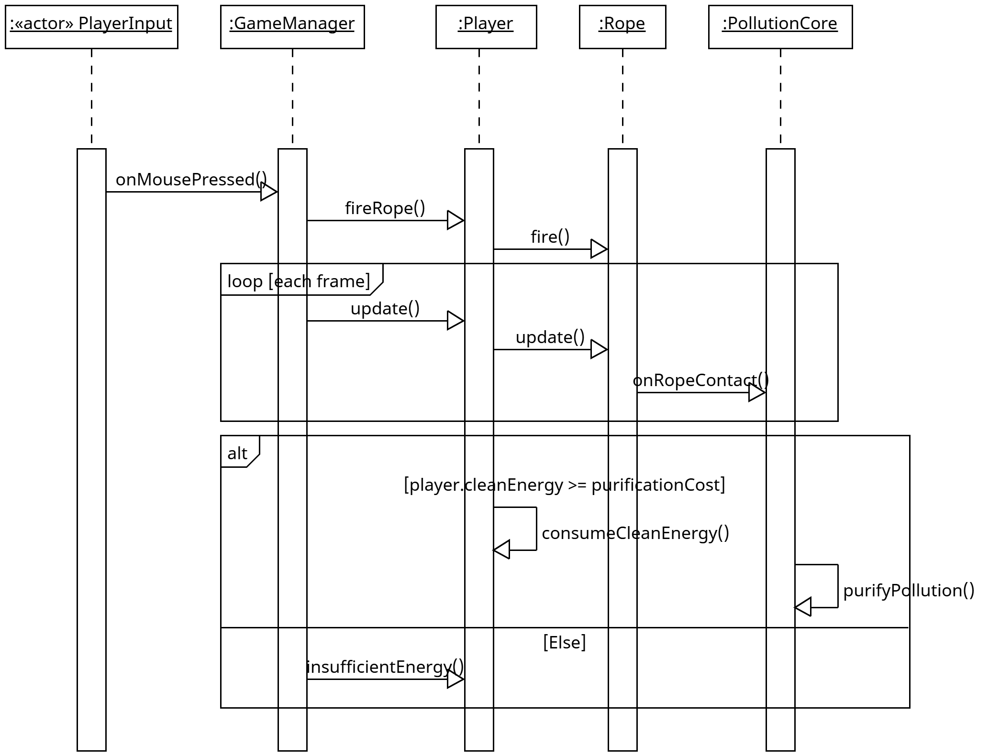

  <b>Figure 8.</b> Rope Interaction and Pollution Purification

When a `Player` performs an input action, the `GameMnager` first receives the input event and triggers `fireRope()` method. Then the `Player` calls the rope's `fire()` method and launches the rope towards the target. In each frame update loop, the `GameManager` continuously calls the player's `update()` method, updating the rope's state. When the rope contacts an environmental object, the target object's `onRopeContact()` method is triggered. If it contacts a pollution core, a purification process begins: when the player's clean energy meets the condition (player.cleanEnergy ≥ purificationCost), the corresponding energys are consumed, and the `PollutionCore` executes `purifyPollution()` to update the state; otherwise, the system triggers insufficient energy logic and maintains the `PollutionCore's` current state.

## 4.5 Unlock New Area Sequence Diagram
The sequence diagram (Figure 9) shows how the system determines whether to unlock new game areas based on the player's purification progress.

  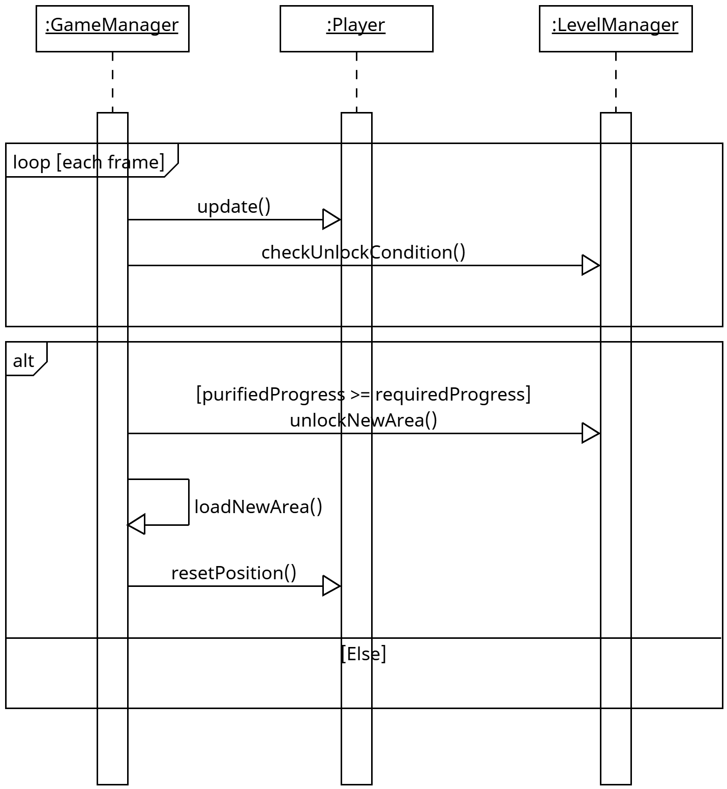

  <b>Figure 9.</b> Unlock New Area

The`GameManager` calls player's `update()` method to refresh the player's state in each frame's update loop. At the same time, the system checks if the area unlocking conditions are met using the LevelManager's `checkUnlockCondition()` method. If the player's purification progress reaches the preset requirement (`purifiedProgress ≥ requiredProgress`), the system triggers `unlockNewArea()` to unlock a new area. The `GameManager` then loads the new level data and calls `loadNewArea()` to complete the area switch. After the new area is loaded, the system resets the player's position using `resetPosition()`, allowing the player to enter the new area. If the unlocking conditions are not met, no area switch is triggered, and the game loop continues.

# 5. Implementation

## Challenge 1: Physical World System
One of the challenges we faced was to integrate rope gameplay deeply and naturally into the game world, which serves as the core mechanic of the game. At the initial stage of game design, we created two forms of ropes (soft and hard) as well as rope heads made of different materials, such as balloons, iron balls, and water balls. To facilitate the use of ropes in puzzle mechanics, real-world physical forces are integrated into the design. Furthermore, to deliver smoother `player` movement and more in-depth interaction with the game world, the design of a realistic physics system was indispensable. To address this challenge, we integrated all fundamental physical forces into the game world, including gravity, forces of ropes , air resistance, ground friction, water buoyancy and so on.

To achieve the simultaneous effects of multiple forces, we must calculate how all forces affect every entity in the game world each frame, with primary forces acting mainly on the `player` and `ropes`. The `draw` method in `main.js` runs once per frame, within which the `update` method from `game-manager.js` is called to trigger the `update` functions of all objects in the game world. Each object's update method refreshes all forces and their resulting effects.

Taking the `player` as an example, it has attributes of `vx, vy, x and y`. Among them, `x and y` represent the player's coordinates, while `vx and vy` stand for the player's velocity vectors on the `X-axis` and `Y-axis`. Forces can be simulated by adding to or subtracting from `vx and vy`. After updating the velocity values, the next position of the player is calculated by updating the `x and y` coordinates following the formula: $x_{n+1} = x_n + vx$.

How does this physics system realize various in-game interactions? Taking the `player`'s movement and jumping as examples: instead of moving a fixed distance in a set direction, movement and jumping apply a force (`vx and vy`) toward the target direction. This force is constantly altered by friction, air resistance and gravity. As a result, the player will gradually slow down when moving on the ground. If the `ground friction` is low, the `player` will slide a long distance after pressing the movement key. When `jumping`, the `player` first decelerates while moving upward, then accelerates continuously downward until landing.

This design brings two major advantages. First, it ensures that the `player` can accurately respond to the combined effect of various forces, making it easier to expand and realize interactive logic between the player and environmental objects in the real world, such as `water`, `ground` and `ladders`. For instance, when the `player` is on a `ladder`, the clinging effect can be achieved simply by counteracting gravity with the force of `vy -= GameConfig.World.GRAVITY`.When hit by an enemy, additional `vx` and `vy` can be added directly along the knockback direction. There is no need for repeated state judgment or conflict checking between different `player` statuses to determine the final position, greatly facilitating the addition of new game features.

Second, predicting the `player`'s upcoming position through `vx` and `vy` simplifies collision detection. If the calculated next position of the `player` is inside a wall, the coordinates can be easily adjusted outward based on the movement direction, thereby achieving realistic collision effects.

  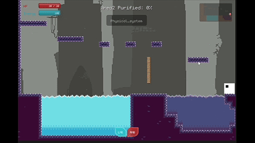

  <b>Figure 10.</b> Player Move in Game World with Various Forces

## Challenge 2:  Rope Mechanic Implementation

The rope system is one of the most important gameplay mechanisms in this game. Players can use ropes for movement, attacking enemies, and purifying pollution sources. Therefore, the rope system needs to be closely integrated with the player's movement and map collision systems. At the same time, it must remain stable and responsive during gameplay.

To achieve this mechanism, we have designed the rope as a state machine-based system. The rope includes several states such as `IDLE`, `EXTENDING`, `STRAND`, `SWINGING`, and `RETRACTING`. When the player fires the rope, the rope tip moves forward like a projectile. A ray-casting method is used to detect collisions with solid tiles. When designing the rope system, we used ray detection to determine whether the rope was colliding with any entities in the map. In the game, the rope is not represented by a simple straight line, but is formed by connecting multiple nodes together. This design can truly simulate the shape of the rope allowing the soft rope to reach areas that a straight rope cannot under physical system. At the same time, this design also makes it convenient for players to adjust the length of the rope during the game. Based on this design, players can control the length of the rope, enabling them to perform actions such as swinging, approaching the target, or moving downward. To make the movement of the rope more stable, we added distance constraints between adjacent nodes. 

Assume two connected nodes **A** and **B** with positions `pA` and `pB`.  
Let **L** be the desired distance between them (the rope segment length).

**Step 1: Compute the current distance**

$$
\Delta = \mathbf{p_B} - \mathbf{p_A}
$$

$$
d = \|\Delta\|
$$

**Step 2: Compute the correction offset**

$$
\text{offset} = \frac{d - L}{d}
$$

**Step 3: Update node positions**

If both nodes have equal mass, the correction is distributed equally:

$$
\mathbf{p_A} = \mathbf{p_A} + \Delta \cdot \text{offset} \cdot 0.5
$$

$$
\mathbf{p_B} = \mathbf{p_B} - \Delta \cdot \text{offset} \cdot 0.5
$$

The game also offers two different types of ropes: soft ropes and hard ropes. Therefore, in the design process we needed to ensure that the physical system of the rope and the collision system would not conflict with each other. If the positions of the players are independently modified by the two systems, it may cause the character movement to be jittery or unstable. Therefore we have clearly designed the update sequence. First of all, the rope constraint will adjust the player's position. Then, collision detection is carried out, and finally, the player's position is restricted based on the length of the rope. By following this sequence, it is possible to prevent mutual interference between the two systems, ensuring that both the rope system and the platform collision system operate stably.

  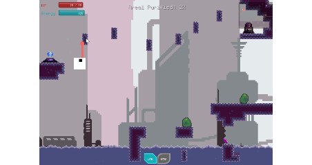

  <b>Figure 11.</b> Rope Anchored to Geometry

  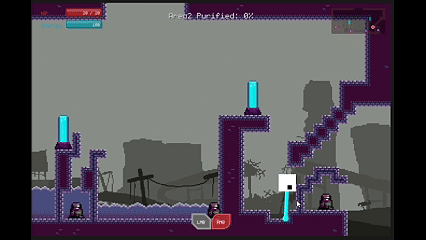

  <b>Figure 12.</b> Rope Usage Example

# 6. Evaluation

## 6.1 Qualitative Evaluation
### Heuristic Evaluation
We invited several evaluators to trial our game and assessed the interface according to Nielsen's ten usability heuristics. This approach was chosen because heuristic evaluation is a common and effective way to identify usability issues within interactive systems (Nielsen & Morich, 1990; Nielsen, 1994). During the evaluation, we recorded the primary usability issues and assessed their severity based on frequency, impact, and persistence, thereby calculating an overall severity score (Table 3).

<b>Table 3. </b> Heuristic Evaluation of <i>Echoes of Purity</i>

<table>
<tr>
<th>Interface</th>
<th>Issue</th>
<th>Heuristic(s)</th>
<th>Frequency</th>
<th>Impact</th>
<th>Persistence</th>
<th>Severity</th>
</tr>

<tr>
<td>HUD (Player Status)</td>
<td>The HP and CleanEnergy values are displayed only as plain text without visual indicators such as bars or icons, making it difficult for players to quickly interpret their current status during gameplay.</td>
<td>Visibility of system status; Recognition rather than recall</td>
<td>3</td>
<td>2</td>
<td>2</td>
<td>2.33</td>
</tr>

<tr>
<td>Game objective</td>
<td>The purification progress indicator may not clearly explain how players can increase the purification percentage.</td>
<td>Match between system and real world</td>
<td>2</td>
<td>2</td>
<td>2</td>
<td>2</td>
</tr>

<tr>
<td>Controls</td>
<td>The game requires players to remember multiple keyboard controls (e.g., WASD, Q, E), which may increase cognitive load and make it difficult for new players to learn the controls quickly.</td>
<td>Recognition rather than recall; Help and documentation</td>
<td>4</td>
<td>2</td>
<td>3</td>
<td>3</td>
</tr>

<tr>
<td>Gameplay introduction</td>
<td>The game does not provide a tutorial or clear instructions for new players, which may make it difficult for them to understand the rope mechanics and purification system.</td>
<td>Help and documentation</td>
<td>2</td>
<td>4</td>
<td>2</td>
<td>2.7</td>
</tr>

<tr>
<td>Rope mechanics</td>
<td>The rope mechanics are not clearly explained to the player, making it difficult for new players to understand how to use the rope for traversal.</td>
<td>Help and documentation; Recognition rather than recall</td>
<td>3</td>
<td>4</td>
<td>3</td>
<td>3.33</td>
</tr>

<tr>
<td>Combat feedback</td>
<td>Monsters do not appear to be knocked back when hit by the player, while the player is knocked back when attacked. This creates inconsistent combat feedback and may make the interaction feel unfair.</td>
<td>Visibility of system status; Consistency and standards</td>
<td>3</td>
<td>3</td>
<td>3</td>
<td>3</td>
</tr>

<tr>
<td>Game difficulty</td>
<td>The game may be too difficult for new players, as the mechanics and challenges require significant practice before players can progress.</td>
<td>Flexibility and efficiency of use</td>
<td>4</td>
<td>4</td>
<td>3</td>
<td>3.7</td>
</tr>
</table>

Based on the results of the heuristic evaluation, we propose the following improvements to address the primary usability issues identified. For the interface, we will add more intuitive HUD designs, such as progress bars or icons to represent health and clean energy. For controls, we will simplify operations or providing prompts to reduce players' cognitive load. Moreover, we will introduce straightforward tutorials and hints to help new players better understand the rope mechanics and game objectives. Finally, we will adjust the game's difficulty and refine combat feedback to deliver a clearer and fairer experience.

## 6.2 Quantitative Evaluation
To evaluate the user experience of the game under different difficulty levels, we conducted a quantitative evaluation using questionnaire-based measures and statistical analysis:

- **NASA TLX** – measure players’ perceived workload during gameplay  
- **System Usability Scale (SUS)** – evaluate the overall usability of the system  
- **Wilcoxon Signed-Rank Test** – examine whether there are statistically significant differences between the two difficulty levels  

A total of 10 participants took part in the evaluation. Each participant played the game in both **Easy** and **Hard** difficulty modes. After completing each difficulty level, participants filled out the NASA TLX and SUS questionnaires to report their perceived workload and usability experience. The collected scores were then analysed using the Wilcoxon Signed-Rank Test to determine whether the differences between the two difficulty levels were statistically significant.

### GAME EASY LEVEL
### NASA TLX

<b>Table 4. </b>NASA TLX Workload Scores for the Easy Difficulty Level

<table>
<tr>
<th>Player</th>
<th>Mental Demand</th>
<th>Physical Demand</th>
<th>Temporal Demand</th>
<th>Performance</th>
<th>Effort</th>
<th>Frustration</th>
<th>Average</th>
</tr>

<tr><td>1</td><td>5</td><td>2</td><td>2</td><td>7</td><td>7</td><td>5</td><td>4.67</td></tr>
<tr><td>2</td><td>4</td><td>4</td><td>6</td><td>5</td><td>6</td><td>5</td><td>5.00</td></tr>
<tr><td>3</td><td>7</td><td>6</td><td>2</td><td>8</td><td>8</td><td>7</td><td>6.33</td></tr>
<tr><td>4</td><td>6</td><td>6</td><td>6</td><td>3</td><td>8</td><td>3</td><td>5.33</td></tr>
<tr><td>5</td><td>6</td><td>1</td><td>1</td><td>0</td><td>7</td><td>1</td><td>2.67</td></tr>
<tr><td>6</td><td>4</td><td>2</td><td>3</td><td>3</td><td>7</td><td>3</td><td>3.67</td></tr>
<tr><td>7</td><td>6</td><td>6</td><td>5</td><td>2</td><td>5</td><td>2</td><td>4.33</td></tr>
<tr><td>8</td><td>6</td><td>6</td><td>3</td><td>4</td><td>7</td><td>4</td><td>5.00</td></tr>
<tr><td>9</td><td>3</td><td>5</td><td>3</td><td>8</td><td>2</td><td>2</td><td>3.83</td></tr>
<tr><td>10</td><td>5</td><td>8</td><td>2</td><td>5</td><td>7</td><td>2</td><td>4.83</td></tr>

</table>

### System Usability Scale

<b>Table 5. </b>SUS Scores for the Easy Difficulty Level

<table>
<tr>
<th>Question No \ Player No</th>
<th>1</th>
<th>2</th>
<th>3</th>
<th>4</th>
<th>5</th>
<th>6</th>
<th>7</th>
<th>8</th>
<th>9</th>
<th>10</th>
</tr>

<tr>
<td>1. I think that I would like to use this system frequently.</td>
<td>3</td><td>4</td><td>4</td><td>4</td><td>5</td><td>4</td><td>4</td><td>4</td><td>3</td><td>5</td>
</tr>

<tr>
<td>2. I found the system unnecessarily complex.</td>
<td>3</td><td>3</td><td>4</td><td>3</td><td>1</td><td>2</td><td>2</td><td>2</td><td>3</td><td>1</td>
</tr>

<tr>
<td>3. I thought the system was easy to use.</td>
<td>3</td><td>4</td><td>1</td><td>3</td><td>5</td><td>3</td><td>4</td><td>4</td><td>2</td><td>4</td>
</tr>

<tr>
<td>4. I think that I would need the support of a technical person to be able to use this system.</td>
<td>1</td><td>4</td><td>4</td><td>4</td><td>4</td><td>3</td><td>4</td><td>2</td><td>4</td><td>2</td>
</tr>

<tr>
<td>5. I found the various functions in this system were well integrated.</td>
<td>4</td><td>4</td><td>3</td><td>4</td><td>5</td><td>5</td><td>4</td><td>4</td><td>5</td><td>4</td>
</tr>

<tr>
<td>6. I thought there was too much inconsistency in this system.</td>
<td>2</td><td>1</td><td>2</td><td>3</td><td>1</td><td>1</td><td>2</td><td>1</td><td>1</td><td>2</td>
</tr>

<tr>
<td>7. I would imagine that most people would learn to use this system very quickly.</td>
<td>3</td><td>2</td><td>1</td><td>4</td><td>4</td><td>3</td><td>3</td><td>4</td><td>3</td><td>4</td>
</tr>

<tr>
<td>8. I found the system very cumbersome to use.</td>
<td>3</td><td>1</td><td>3</td><td>2</td><td>1</td><td>2</td><td>2</td><td>2</td><td>1</td><td>2</td>
</tr>

<tr>
<td>9. I felt very confident using the system.</td>
<td>3</td><td>2</td><td>2</td><td>4</td><td>5</td><td>2</td><td>4</td><td>3</td><td>2</td><td>4</td>
</tr>

<tr>
<td>10. I needed to learn a lot of things before I could get going with this system.</td>
<td>2</td><td>3</td><td>3</td><td>3</td><td>2</td><td>3</td><td>4</td><td>4</td><td>3</td><td>2</td>
</tr>

<tr>
<td>System Usability Survey Score</td>
<td>62.5</td>
<td>60</td>
<td>37.5</td>
<td>60</td>
<td>87.5</td>
<td>65</td>
<td>62.5</td>
<td>70</td>
<td>57.5</td>
<td>80</td>
</tr>

</table>

### GAME HARD LEVEL
### NASA TLX

<b>Table 6. </b>NASA TLX Workload Scores for the Hard Difficulty Level

<table>
<tr>
<th>Player</th>
<th>Mental Demand</th>
<th>Physical Demand</th>
<th>Temporal Demand</th>
<th>Performance</th>
<th>Effort</th>
<th>Frustration</th>
<th>Average</th>
</tr>

<tr><td>1</td><td>6</td><td>2</td><td>1</td><td>5</td><td>8</td><td>6</td><td>4.67</td></tr>
<tr><td>2</td><td>8</td><td>6</td><td>2</td><td>1</td><td>8</td><td>7</td><td>5.33</td></tr>
<tr><td>3</td><td>6</td><td>7</td><td>3</td><td>7</td><td>6</td><td>6</td><td>5.83</td></tr>
<tr><td>4</td><td>8</td><td>8</td><td>6</td><td>6</td><td>8</td><td>3</td><td>6.50</td></tr>
<tr><td>5</td><td>7</td><td>1</td><td>2</td><td>0</td><td>8</td><td>2</td><td>3</td></tr>
<tr><td>6</td><td>5</td><td>7</td><td>2</td><td>9</td><td>3</td><td>6</td><td>5.33</td></tr>
<tr><td>7</td><td>6</td><td>5</td><td>8</td><td>6</td><td>7</td><td>2</td><td>5.67</td></tr>
<tr><td>8</td><td>8</td><td>6</td><td>3</td><td>6</td><td>7</td><td>5</td><td>5.83</td></tr>
<tr><td>9</td><td>5</td><td>6</td><td>4</td><td>8</td><td>7</td><td>7</td><td>6.17</td></tr>
<tr><td>10</td><td>7</td><td>6</td><td>3</td><td>6</td><td>4</td><td>1</td><td>4.50</td></tr>

</table>

### System Usability Scale

<b>Table 7. </b>SUS Scores for the Hard Difficulty Level

<table>
<tr>
<th>Question No \ Player No</th>
<th>1</th>
<th>2</th>
<th>3</th>
<th>4</th>
<th>5</th>
<th>6</th>
<th>7</th>
<th>8</th>
<th>9</th>
<th>10</th>
</tr>

<tr>
<td>1. I think that I would like to use this system frequently.</td>
<td>2</td><td>3</td><td>4</td><td>3</td><td>5</td><td>4</td><td>5</td><td>4</td><td>4</td><td>4</td>
</tr>

<tr>
<td>2. I found the system unnecessarily complex.</td>
<td>3</td><td>5</td><td>4</td><td>3</td><td>1</td><td>4</td><td>2</td><td>4</td><td>1</td><td>4</td>
</tr>

<tr>
<td>3. I thought the system was easy to use.</td>
<td>2</td><td>1</td><td>2</td><td>2</td><td>5</td><td>2</td><td>5</td><td>2</td><td>2</td><td>3</td>
</tr>

<tr>
<td>4. I think that I would need the support of a technical person to be able to use this system.</td>
<td>2</td><td>4</td><td>4</td><td>4</td><td>3</td><td>3</td><td>4</td><td>4</td><td>2</td><td>3</td>
</tr>

<tr>
<td>5. I found the various functions in this system were well integrated.</td>
<td>4</td><td>3</td><td>2</td><td>4</td><td>5</td><td>3</td><td>4</td><td>5</td><td>5</td><td>4</td>
</tr>

<tr>
<td>6. I thought there was too much inconsistency in this system.</td>
<td>1</td><td>1</td><td>2</td><td>3</td><td>1</td><td>1</td><td>2</td><td>1</td><td>2</td><td>3</td>
</tr>

<tr>
<td>7. I would imagine that most people would learn to use this system very quickly.</td>
<td>4</td><td>1</td><td>1</td><td>3</td><td>5</td><td>3</td><td>4</td><td>1</td><td>2</td><td>3</td>
</tr>

<tr>
<td>8. I found the system very cumbersome to use.</td>
<td>3</td><td>1</td><td>3</td><td>3</td><td>1</td><td>2</td><td>2</td><td>4</td><td>1</td><td>3</td>
</tr>

<tr>
<td>9. I felt very confident using the system.</td>
<td>3</td><td>1</td><td>2</td><td>3</td><td>5</td><td>2</td><td>3</td><td>2</td><td>4</td><td>2</td>
</tr>

<tr>
<td>10. I needed to learn a lot of things before I could get going with this system.</td>
<td>2</td><td>4</td><td>4</td><td>4</td><td>1</td><td>4</td><td>4</td><td>4</td><td>4</td><td>3</td>
</tr>

<tr>
<td>System Usability Survey Score</td>
<td>60</td>
<td>35</td>
<td>35</td>
<td>45</td>
<td>95</td>
<td>50</td>
<td>67.5</td>
<td>42.5</td>
<td>67.5</td>
<td>50</td>
</tr>

</table>

### Mean Results for NASA TLX and SUS

  

  <b>Figure 13.</b> Mean NASA TLX Workload Scores for the Easy and Hard Difficulty Levels

  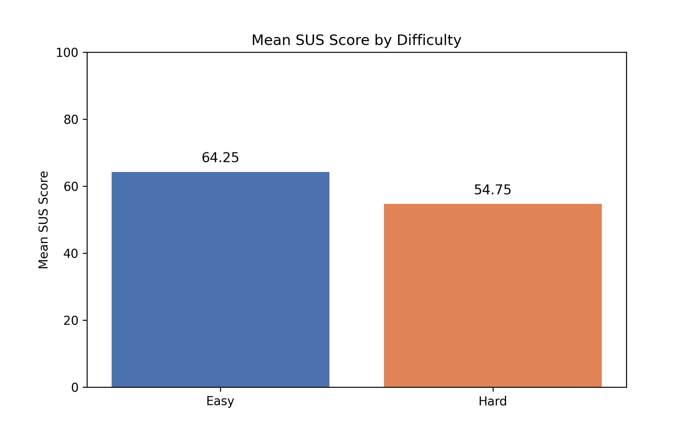

  <b>Figure 14.</b> Mean SUS Scores for the Easy and Hard Difficulty Levels

According to firgue 13, the mean NASA-TLX workload score was **4.57** for the Easy level and **5.30** for the Hard level, indicating slightly higher perceived workload at the Hard difficulty. The mean **SUS score** was **64.25** for Easy and **54.75** for Hard (Figure 14), suggesting slightly better usability for the Easy level.

### Statistical Analysis

<b>Table 8. </b>Wilcoxon Signed-Rank Test Results Comparing Difficulty Levels

<table>
<tr>
<th>Measure</th>
<th>n</th>
<th>W</th>
<th>Critical Value</th>
<th>Significant</th>
</tr>

<tr>
<td>NASA TLX</td>
<td>9</td>
<td>6</td>
<td>5</td>
<td>No</td>
</tr>

<tr>
<td>SUS</td>
<td>10</td>
<td>12</td>
<td>8</td>
<td>No</td>
</tr>

</table>

The Wilcoxon Signed-Rank Test results (Table 8) indicate that there was no statistically significant difference in perceived workload or usability between the Easy and Hard difficulty levels. One tied pair in the NASA TLX data resulted in n=9 for the workload analysis.

### Findings
The above result shows that there is not enough evidence to support the obvious differences in workload and availability of the two modes, and players may not be able to clearly perceive the differences between different difficulties. Therefore, we have made corresponding adjustments to the game to make the difference between different difficulties more obvious.Furthermore, even in easy mode, the workload for players is still not low, while SUS scores are at a moderate level. Based on these quantitative analysis results, we made adjustments to the game. First, we redesigned the map structure. Previously, the main difference between easy and hard modes was the number of maps. Now, easy mode reduced difficulty by removing more difficult maps. We have designed different maps for each difficulty level. The paths in easy mode are clearer, and the use of rope mechanics is reduced, making it easier for players to purify the pollution core, thus better differentiating the difficulty levels visually and in terms of gameplay. Second, we adjusted player attributes. We add a resource panel to view the player state (Figure 15). In easy mode, Player can more easily get ability upgrades, such as jump ability, rope length, and attack power. These adjustments make the differences between the different modes more clearly.

  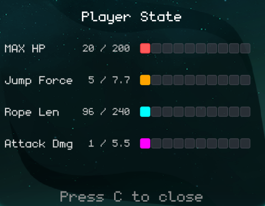

  <b>Figure 15.</b> Resource Panel

## 6.3 How Code Was Tested
During the game development process, we conducted continuous testing on various functional modules. Our testing methodology can be divided into two parts: **black-box testing** and **white-box testing**.

In **black-box testing**, we utilized automatic testing tools to confirm user interaction processes and interface functions, for example entering the main menu, clicking "Start Game", altering the difficulty degree, unfolding the resource panel, and changing among different interfaces. However, as for modules that include continuous changes, for example player moving, jumping and rope launching, hence it is very difficult to judge their correctness only according to frame-by-frame output. Hence, we also depend on visual and interactive assessments to watch if the movement velocity is reasonable, if jumping and falling accord with basic physical intuition, and if the rope movement shows a natural dynamic effect.

On another hand, **white-box testing** concentrates on checking the program's inside logic, judging the rightness of the realization through observing alterations in values and states in particular game situations. For instance, we have carried out tests on the underlying logic of player health (HP) changes, clean energy consumption, and the triggering of invincibility states. In the testing phase, we have designed many kinds of input situations to get the function's returning outcomes, and at the same time we process and check inputs that may have no validity. Below is one of examples of the test code (Figure 16).

**Example -- Player Damage and Invulnerability Logic**

  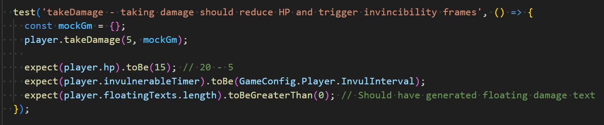

  <b>Figure 16.</b> Player Damage and Invulnerability Logic

In terms of tools, we used **VS Code** to run the project code based on p5.js, and combined it with testing tools such as **Jest** and **Cypress** to further verify specific functions. Through black-box testing and white-box testing, we are able to ensure a smooth game experience and the correctness of the code logic.

# 7. Process 

## Teamwork

We adopt an iterative and incremental development based on Kanban and Scrum in Agile. At the beginning of the process, we always discuss our ideas after class. In addition, we divided roles according to those areas we preferred (such as testing, UI, as shown in the table earlier). Following the Agile philosophy, on which days with classes, Scrum Master Ruomu Lu organized everyone to hold stand-up meetings (basically 3 or 4 times a week). Usually, we discussed the progress of the previous week on Monday; then, on Tuesday of each week (after the lab class of this course), Program Owner Yifei Niu determines our goals for this week and assigns new tasks. She also put those tasks on our Jira Kanban board. At meetings on Thursday, we usually discuss challenges we encountered, which also avoids a large amount of work piling up on the day before delivery.

  

  <b>Figure 17.</b> Stand-up Meeting in MVB

<b>Table 9. </b> Sprint Breakdown Showing Timelines and Goals

| Sprint  | Time       | Goal |
|---------|------------|------|
| Sprint 1 | Week 3–6  | Generate the first version of the demo (one difficulty level) |
| Sprint 2 | Week 7–8  | Add two difficulty levels and expand functionality |
| Sprint 3 | Week 9–10 | Improve the UI system and enhance user experience |

We divided the development process into three sprint phases based on the course schedule. During the sprint review, we check if the functions meet their Acceptance Criteria. If there exist functions that need to be improved, we add them to the Product Backlog and continue to refine it in the next sprint. After that, we reflect on our workflow during the sprint retrospective. In the later stage of development, we no longer strictly obey the initial division of responsibilities in the development field. This is mainly because we want to make sure everyone participates in programming as much as possible.

## tools

Here are some of the tools we used:

- **Jira**

We use it as a Kanban board to manage tasks, it allows us to organise work into 3 stages

  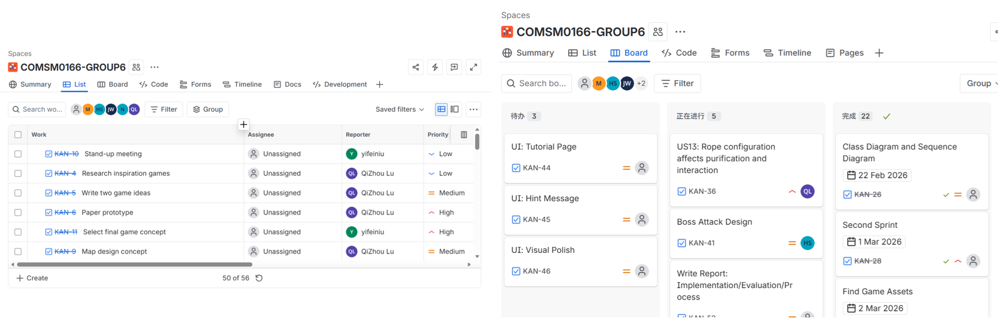

  <b>Figure 18.</b> Jira Kanban Board

- **Wechat**

Used for group online communication.

- **Tencent Meeting**

Since face-to-face communication is not possible during vacation, we use Tecent Meeting to hold remote meetings. Its features, such as screen sharing, allow us to maintain development wherever we are.

  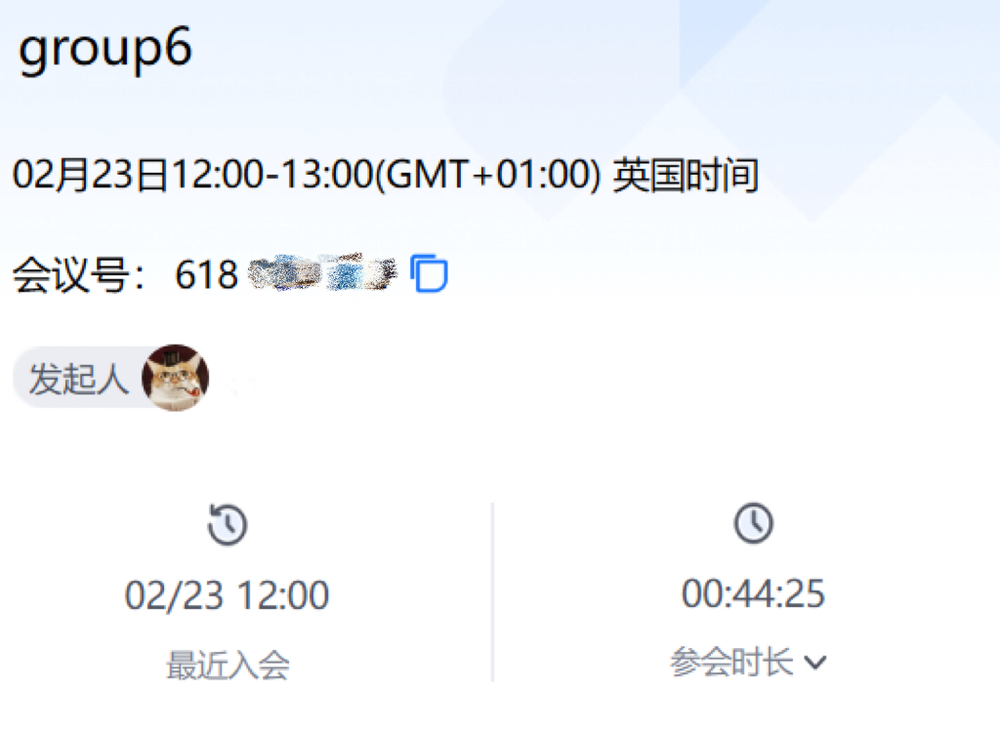

  <b>Figure 19.</b> Online Stand-up Meeting Via Tencent Meeting 

- **GitHub and Git**

Used for version control. The main tool used for code division and collaboration.

- **Visual Studio Code**

The platform for code development.

- **LDTK**

LDtk is used for map design. The reason why we use it is not only because it exchanges map and level as a JSON file, but also since the visual editor totally improves our efficiency. Additionally, we defined entities with specific attributes(such as pollution core and door) within LDtk.

  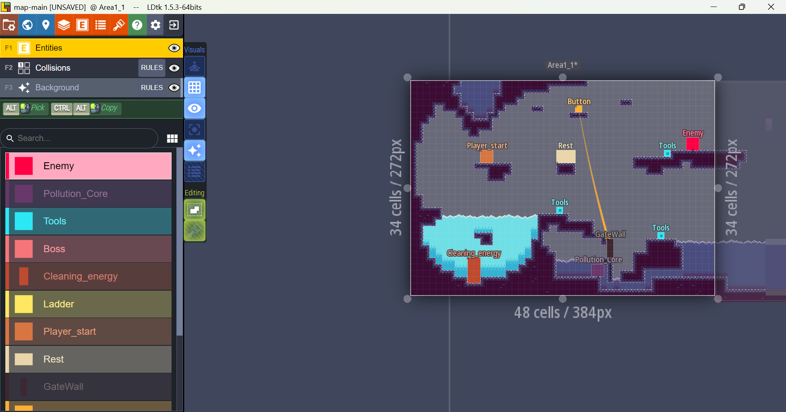

  <b>Figure 20.</b> LDtk Map Design Interface 

## Reflection

### Demand Conflicts and Design Complexity

At the beginning of the process, each of us had many different ideas, which always conflicted with each other. And some of them were hard to implement. To prevent becoming too complex or delayed, we prioritised the tasks and implemented the necessary functions first. We also made prototypes to verify our ideas, and many ideas were discarded naturally in this section.

During the evaluation stage, we used many quantitative and qualitative methods, especially the think-aloud method, which allowed us to eliminate many complex functions, and then we simplified the gameplay of the game a lot. For example, in the first version, the red and blue ropes were separately extended by Q and E; shortened using Z and C; change between hard and soft modes of the ropes by 1 and 2. Additionally, players should use the mouse to control the direction of the ropes, and the left and right mouse buttons to control which rope to launch!!! (I’m exhausted just writing this sentence) Not to mention that we also developed a series of super fun but super difficult functions based on ropes, including climbing walls and doing a pole vault with a hard rope. Obviously, hardly anyone who participated in the testathon can learn those operations in a short time(even a long time). After that, we gave up the function of switching the hardness of the ropes, and for the length of the ropes (choose which rope to control according to the distance of mouse and rope), it could be only controlled using the mouse (with its wheel).

Overall, we learned the importance of prioritising simplicity in design. While complex mechanics may seem appealing at first, they could decrease usability. We also realised the value of early user testing, as it helped us identify issues that were not obvious during development. This reflects key principles in both HCI and Agile development, particularly the importance of user-centred design, simplicity, and responding to feedback through iterative improvement.

### Merge Conflicts

During the early stage, merge conflicts several times, mainly because we had several people modifying the same file or even the same function simultaneously. To solve this problem, we detailed the task allocation and introduced the pull request process. Members who modified the code worked on separate branches, and our coder, Ruomu Lu, conducted code review before merging.

  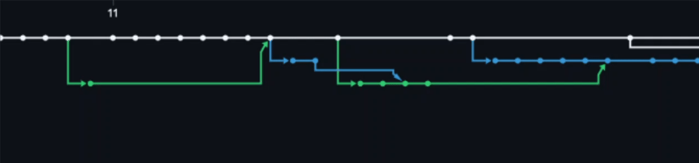

  <b>Figure 21.</b> GitHub Network Graph Showing Branching and Merging During Development 

### Critical Reflection

Our team’s development approach gradually grew from a relatively loosely organised state to one with more standardised processes and a Scrum framework. If we were to start this project again, we would aim to follow Scrum more consistently. And we would also use more quantitative methods to monitor the process.

# 8. Sustainability

## Sustainability Awareness Framework (SusAF)

One of the core mechanisms of our game is the restoration of the ecosystem, which means that when the purification progress reaches a certain fixed value, the environment will change. This mechanism can directly demonstrate the consequences of environmental pollution and connect the game with real-world issues. This also demonstrates the concern of our group for sustainability. To analyse the wider impact of our game, we used the Sustainability Awareness Framework (SusAF), which is designed to evaluate sustainability impacts across multiple dimensions (Becker et al., 2015).

At the environmental level, the main contribution of our game is to make the process of environmental destruction and restoration visible. In the background setting of the game, this planet has been severely polluted and is no longer suitable for habitation. And the player's goal is to purify the contaminated creatures and the contaminated core. This establishes a causal link between environmental pollution and environmental restoration. The pollution settings in the game will hinder the player's progress and make certain areas even more dangerous, such as contaminated water sources. When players purify the pollution, the game world will also change. For instance, the polluted water sources will become clean and the ground will turn green. At the same time, this also forms a clear chain of environmental effects: pollution damages the world, players take action, and then a recovery outcome occurs. By repeatedly going through this process, players can understand that environmental restoration requires continuous effort. This effectively reinforces players' understanding of their responsibility towards the environment.

At the individual level, the game helps players understand the importance of action in protecting the environment. In the game, pollution is not merely a simple background element. It actually has a direct impact on the game world, and players can change this world through the game's purification mechanism. Instead of only reading about environmental ideas, players experience them through play. This makes "environmental responsibility" more concrete. At the same time, players have a high degree of autonomy in the game. For instance, players can choose to purify or not to purify the pollution sources, and the progress of the area's purification will determine the course of the game. This ensures that the player's actions will receive immediate feedback within the game, enabling them to realize that as long as they keep making efforts, it is possible to restore the environment. In this way, the game encourages players to reflect on their own role in environmental protection.

From a technical perspective, the game incorporates systems that support these sustainable development goals. The continuous state of the world and the purification process enable the environmental changes to be recorded, making the progress of purification visible. At the same time, the system is designed to support future expansion and maintenance. This is important for software sustainability, because a maintainable structure makes it easier to continue developing the game over time. Our design makes it possible to add new levels, mechanics, and updates in the future without changing the whole system structure.

  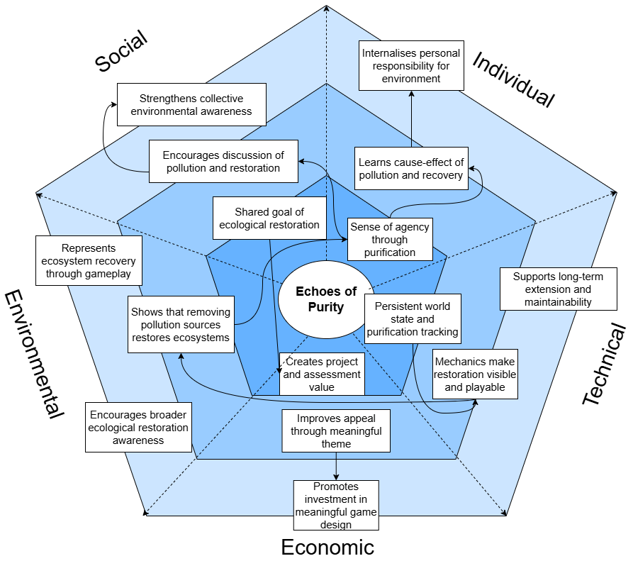

  <b>Figure 22.</b> Sustainability Awareness Framework

## Ethics and Accessibility

From an ethical perspective, our game design ensures that players do not resort to violent destruction of creatures just for the sake of rewards. Instead, it chose to target the sources of pollution and the core of the problem. This aligns with the core concept of the game, which is "repairing" rather than "violence". At the same time, in the process of designing the game, we also avoided treating the restoration of the environment as a simple problem that could be solved with just one action. The closure of the route and the difficulties encountered in purifying the pollution sources all indicate that environmental restoration is a gradual process that depends on continuous efforts.

In terms of accessibility, our current implementation already includes several features. difficulty selection, language switching, as well as control over background music and sound effects. These choices have lowered the entry barrier for new players and are suitable for various types of players.However, there are still areas where the accessibility of our game needs improvement. Some of the core mechanisms in the game, such as rope control and combat, require the simultaneous use of a mouse and keyboard. This might cause difficulties for players who are not familiar with platform games to operate the game. In the future, we will add clearer text labels, more simplified teaching procedures and re-mappable keys.

## Green Software Foundation Patterns
**• Avoid tracking unnecessary data:** 
We avoid collecting and tracking unnecessary user data. The system only interacts based on keyboard input, reducing data processing needs and energy consumption from the source, and improving user privacy protection.

**• Avoid an excessive DOM size:**
We reduce the HTML structure as much as possible, avoid creating too many DOM nodes, and remove unnecessary page elements. The main body of the game uses canvas (such as p5.js) rendering instead of traditional DOM controls, thus reducing the layour and repaint operations, improving rendering efficiency and reducing energy consumption.

**• Deprecate GIFs for animated content:**
We use MP4 video to replace traditional GIF animation. Compared with GIF, MP4 has higher compression efficiency and smaller file volume while ensuring hige image equality, thus reducing data transmission and energy consumption in decoding process of the device.

# 9. Conclusion

In this group assignment, we not only completed a functional game, but also gained a more detailed understanding of all the processes of software engineering. Starting from the initial requirement analysis, to the subsequent design, implementation and testing, we gradually realized that software development is not merely about writing code. Instead, it is a continuous iterative process centered around "problem - requirement - solution".Through the workshops in the third and fourth weeks, we learned to think about issues from the perspectives of different stakeholders, such as players, developers, and course evaluators, etc. Furthermore, during the process of writing epics, user stories, and acceptance criteria, we are able to define the functional goals more clearly and reduce the disagreements that arise during the implementation process. 

Then, during the development process, we adopted an agile approach for iterative development. This approach enables us to identify and address issues in the game more quickly and make adjustments, but it also exposes some challenges in team collaboration, such as unclear code structure and some files bearing too many responsibilities and functions. These issues have made us realize the significance of a good modular design and code organization for long-term maintenance.

From the perspective of challenges, the biggest difficulty of this project lies in how to maintain the consistency of the game state and how to manage the complex system structure. For instance, the persistence of multi-level states and the sequence of resource loading all require us to make additional considerations in the design.

Also, we have also begun to understand the sustainability issues in software engineering. Software not only needs to function in the short term, but also must be maintainable and scalable in the future. The software sustainability mentioned in the course emphasizes long-term effects and system evolution, which makes us realize that the design decisions in game development not only affect the current functions, but also influence future development costs.If we continue to develop this game, our next step will be to prioritize the optimization and reorganization of the code, as well as to improve the testing mechanism to enhance the system's stability. 

At the same time, we will also further enhance the user experience, such as improving the UI and the game feedback mechanism.If there is an opportunity to develop a sequel, we hope to incorporate more complex game mechanics, such as a richer map system, dynamic environmental changes, and deeper narrative content. At the same time, we will plan at the architectural level in advance to support a larger system scale, rather than having to restructure passively later on.

Overall, this game project has enabled us to shift from simply "writing code" to "conducting a software engineering project", and has also allowed us to truly understand the significance of design, collaboration, and long-term thinking.

# 10. Contribution Statement

| Contributor  | Contribution |
|--------------|--------------|
| Qizhou Lu    | 1.00         |
| Yifei Niu    | 1.00         |
| Mengzhou Gao | 1.00         |
| Ruomu Lu     | 1.00         |
| Hang Su      | 1.00         |
| Jiaying Wang | 1.00         |

# 11. AI statement

We used AI to create the game's cover and the opening still animation picture.

Use AI to fill in pixel values when quickly completing the initial layout of controls on pages such as the settings page, so as to reduce the time spent adjusting data such as the relative positions, spacing, and sizes of controls.

Adopt AI to generate partial recommended schemes for enemy movement logic and physical world implementation logic — the latter is a brand-new field for our team — and complete manual coding development.

# 12. Appendix

## **Use Case Specification**

### **UC-01: Explore Polluted Area**

**Goal**  
Allow the player to explore interconnected areas of the game world and discover polluted zones that require purification.

**Basic Flow**

1. The player moves the character using directional controls.
2. The game system updates the character’s position in the current area.
3. The camera follows the player as they traverse the environment.
4. When the player reaches the boundary of a connected area, the system loads the next area.
5. The player continues exploration within the new area.

**Alternative Flow**

**Area Locked by Pollution**

1. The player reaches a blocked passage or polluted gate.
2. The system checks purification progress.
3. If the purification progress does not meet the required standard, then it is impossible to explore the next area.

**Player Falls or Cannot Reach Platform**

1. The player tries to get through this section but cannot.
2. The character returns to the accessible platform.
3. The player continues to explore.

### **UC-02: Purify Pollution Entities**

**Goal**  
Allow players to eliminate enemies and purify purification cores to improve the environmental purification process.

**Basic Flow**

1. The player discovers pollution core or enemies.
2. The player uses ropes to purify pollution core or enemies.
3. The purification action is executed.
4. The pollution entity disappears.
5. The global purification progress value increases.
6. The game provides visual and/or audio feedback to show the purification result.

**Alternative Flow**

**Target Out of Range**

1. The player attempts to purify the pollution core or enemy.
2. The rope failed to detect the target.
3. The action fails and no purification occurs.

**Interrupted Purification**

1. The player begins purification.
2. The player moves away or stops the action.
3. The purification process is cancelled.

 # 13. References

Alexander, I. F. (2005). *A taxonomy of stakeholders: Human roles in system development*. International Journal of Technology and Human Interaction, 1(1), 23–59.

Becker, C., Chitchyan, R., Duboc, L., Easterbrook, S., Penzenstadler, B., Seyff, N., & Venters, C. (2015). Sustainability Design and Software: The Karlskrona manifesto.

Nielsen, J. and Molich, R. (1990). *Heuristic evaluation of user interfaces*. Proceedings of the SIGCHI Conference on Human Factors in Computing Systems.

Nielsen, J. (1994). *Heuristic Evaluation*. In: Nielsen, J. and Mack, R.L. (eds.) Usability Inspection Methods. New York: John Wiley & Sons.

